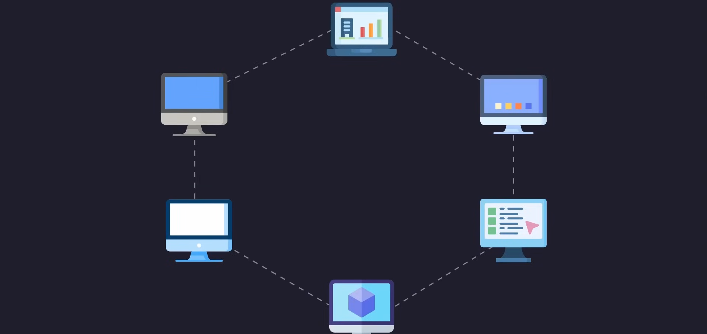
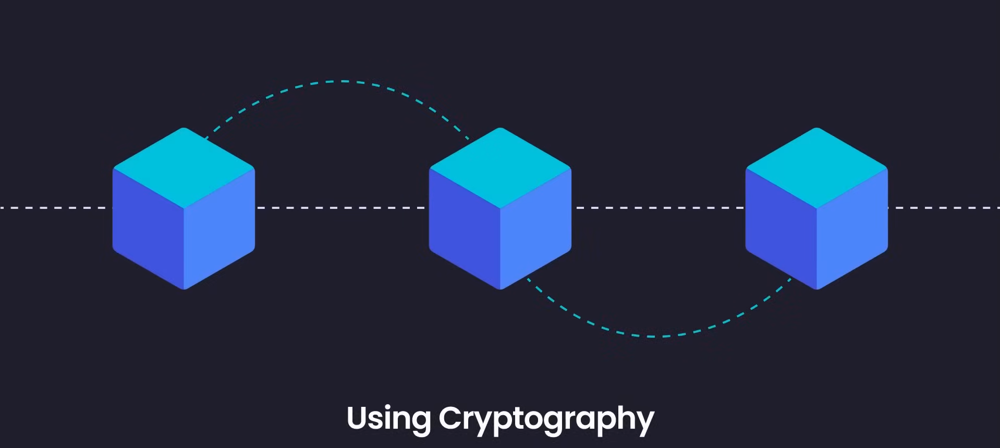
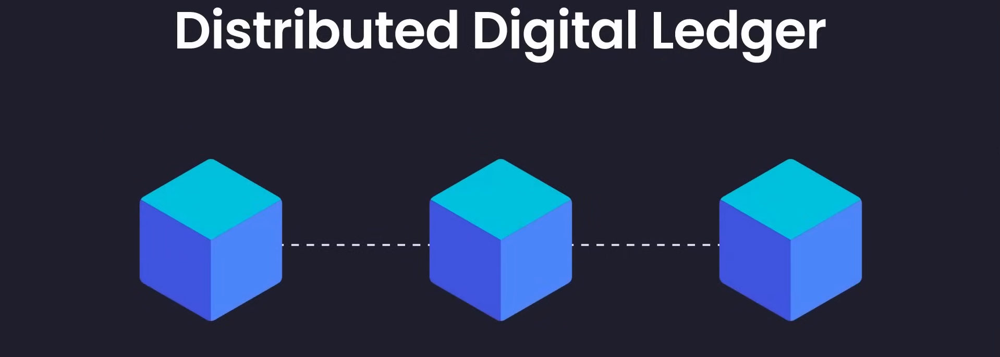
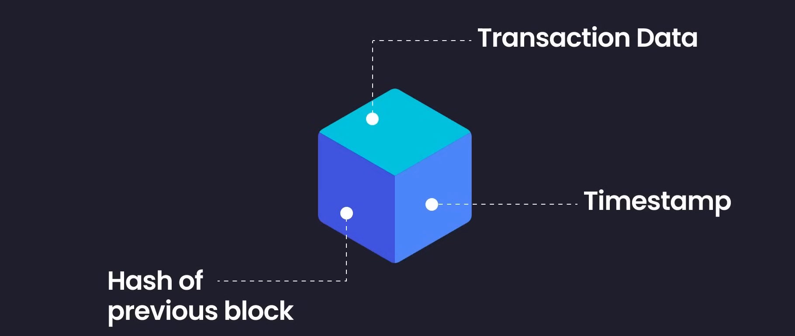
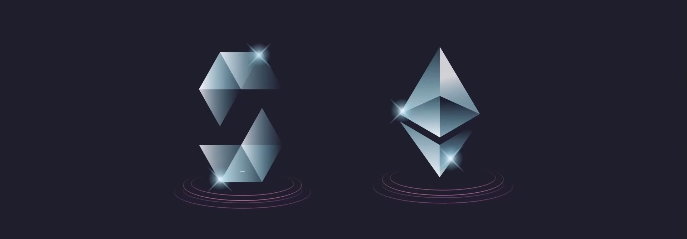
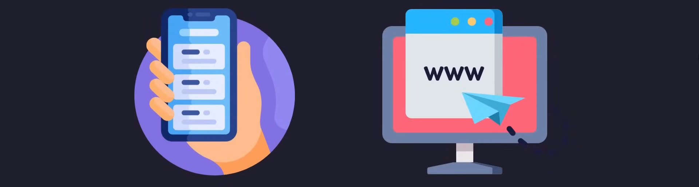

# kintsugi-stack-web3: ROADMAP

> Web 3.0 Roadmap Short Intro.


- Author: [Kintsugi-Programmer](https://github.com/kintsugi-programmer)

> Disclaimer: The content presented here is a curated blend of my personal learning journey, experiences, open-source documentation, and invaluable knowledge gained from diverse sources. I do not claim sole ownership over all the material; this is a community-driven effort to learn, share, and grow together.

---

## Table of Contents
- [kintsugi-stack-web3: ROADMAP](#kintsugi-stack-web3-roadmap)
  - [Table of Contents](#table-of-contents)
- [Web 3.0 Roadmap Short Intro.](#web-30-roadmap-short-intro)

---

# Web 3.0 Roadmap Short Intro.


- **Understanding the Evolution of the Web**
      - 
    - **Web 1.0 (1991 - 2004)**
        - Known as the first stage of the World Wide Web.
        - Consisted mostly of **static sites** and functioned as one big website with hyperlinks,.
        - > It was a **read-only web** with zero interactions (no authentication, comments, or analytics).
        - Users were purely **consumers** of information in a one-way communication tool.
          - 
    - **Web 2.0 (2004 - Present)**
        - Defined by **interactivity, social connectivity, and user-generated content**.
        - Users not only consume information but also send information through websites.
        - > It is based on **interaction and collaboration** in social media dialogues,.
        - **The Centralization Problem**: Platforms are owned by centralized companies (like Meta and Google) that collect data to make money by keeping users on their sites longer.
        - > The main issues are a **lack of privacy** and **total control** held by middlemen and big corporations.
    - **Web 3.0 (The Decentralized Web)**
        - Built on **peer-to-peer networks** of computers that talk to each other without middlemen.
        - No single person or company owns the data; everything is **visible and connected to the public**.
        - Data is **shared rather than owned**.
        - > Unlike centralized servers that can be hacked or go down, Web 3 relies on a community-built network of **interconnected devices**.
          - 
          - 
    - **Summary of Web Generations**
        - **Web 1.0**: Read content and consume.
        - **Web 2.0**: Read and write/interact, but data is **owned by companies**.
        - **Web 3.0**: Read, write, and **own the data**.
    - **Web2 → Web3 shift**
      - **Chrome → Brave**
        - from ad-driven tracking browsers
        - to privacy-first browsing with user-owned ad rewards (tokens)
      - **GoDaddy → ENS**
        - from renting domains from centralized registrars
        - to owning decentralized blockchain domains (.eth names)
      - **Spotify → Audius**
        - from platforms owning music distribution and revenue
        - to artists directly owning content and earning crypto natively
      - **YouTube → Odysee**
        - from centralized video hosting and algorithm control
        - to decentralized video platforms with creator governance
      - **Dropbox → Filecoin**
        - from centralized cloud storage
        - to decentralized, incentive-driven storage networks
      - **Patreon → FanStan**
        - from platform-controlled creator monetization
        - to community-owned creator economies with token membership
      - **WhatsApp → Status**
        - from centralized messaging depending on company servers
        - to encrypted, decentralized, wallet-native messaging apps
      - **Facebook → District0x**
        - from company-owned social networks
        - to DAO-based communities and marketplaces owned by participants
      - **Google Search → Presearch**
        - from ad-monetized search engines using your data
        - to community-powered search rewarding participants
      - **PayPal → MetaMask**
        - from bank-dependent online payments
        - to self-custodied wallets for global peer-to-peer payments
          - 

- **Step 1: Web 2 Skills**
    - **Blockchain technologies** are built on top of web technologies; you cannot learn Web 3 without understanding Web 2 fundamentals.
    - Building blockchain applications requires creating **web apps** that talk to smart contracts.
    - Essential skills include **React, Next.js, or basic JavaScript** to connect decentralized applications (DApps) to regular web apps.

- **Step 2: Blockchain Fundamentals**
    - You must understand what blockchain is, how it works, and why it exists.
    - **Definition**: A blockchain is a network of computers that collectively run a **blockchain client**.
    - It is a **chain of blocks** linked together using cryptography and is considered a **distributed digital ledger**,.
      - 
      - 
    - **Block Components**:
        - 1. A cryptographic hash of the previous block.
        - 2. A timestamp.
        - 3. Transaction data.
          - 
    - **Ethereum Blockchain** is the recommended starting point due to its great technical and community support.

- **Step 3: Learn About Smart Contracts**
      - 
    - **Definition**: Software stored on a blockchain platform that **automatically executes an agreement**.
    - > They allow you to program the blockchain to perform specific sets of instructions and exchange value without middlemen.
    - **Key Characteristics**:
        - **Self-verifying**.
        - **Self-executing**.
        - **Tamper-resistant**.
        - **Immutable**: The code cannot be changed once deployed.
    - > **IBM Definition**: "Smart contracts are simply programs stored on a blockchain that run when predetermined conditions are met. They are typically used to automate an agreement's execution so that all participants can be immediately sure of the outcome without any intermediary's involvement or time loss."
      - Fair and Efficient at both sides of Agreement !!!
    - **Use Cases**: Banking, insurance, copyright, **NFTs**, and back-ends for DApps.

- **Step 4: Learn Solidity**
      - 
    - > **Solidity** is the primary programming language for writing smart contracts on the **Ethereum blockchain**,.
    - It is a relatively new language inspired by **JavaScript, Java, C, and Rust**.
    - It is versatile, intuitive, and often reads like pure English.
    - **Code Example**:
        ```solidity
        pragma solidity >=0.5.0 <0.7.0;

        contract HelloWorld {
            function get() public pure returns (string memory) {
                return "Hello Contracts";
            }
        }
        ```
    - Learning Solidity also serves you well on other blockchains besides Ethereum.
      - 

- **Step 5: Compiling, Testing, and Deploying**
    - Because smart contracts are **immutable**, testing is essential before deployment.
      - 
      - 
    - **Recommended Testing Libraries**: Mocha, Chai, and Ganache.
    - **Recommended Deployment Tools**: Hard Hat, Infura, or Truffle.


- **Step 6: Decentralized Applications (DApps)**
      - 
    - **Definition**: Applications that run on a blockchain, **Decentralized** and are **free from the control of a single authority**.
    - They keep user data out of the hands of big organizations.
    - **Current State**: Most DApps are currently **web apps**.
    - > **Power of DApps**: In a decentralized social media app, if a person posts an image, **no one can delete it**, not even the creator of the application.
    - **Building a DApp** requires:
        - The regular web app (HTML, CSS, JavaScript).
        - Integration with the **blockchain**.
        - Integration with a **wallet**.
    - Integration is typically done using the **Web3.js library**.

- **Step 7: Learn About Crypto Wallets**
    - > Wallets are used to interact with the blockchain and exchange funds securely via **cryptographically signed transactions**.
      - 
    - Using a wallet is similar to using a payment gateway like PayPal, but with **cryptocurrency**.
    - **MetaMask** is the top recommendation; it allows users to access an Ethereum wallet via a browser extension or mobile app to interact with DApps,.
      - 

- **Step 8: Web3.js and Ethers.js**
    - > These libraries connect your front-end application to the blockchain smart contract via the **Ethereum API**.
      - 
    - **Web3.js**: A collection of libraries that connect to local or remote Ethereum nodes using HTTP, websockets, and other protocols.
    - **Ethers.js**: A **lightweight** JavaScript library that connects the JavaScript front-end with Smart Contracts.

- **Step 9: Practice and Portfolio**
    - After learning theory, you must "get your hands dirty" with the technology.
    - > Effective learning involves challenging your capabilities with projects you might find difficult.
    - > Completing **four to five projects** (such as building an NFT marketplace) can make you more proficient than most developers.
    - A **portfolio website** is crucial for showing evidence of expertise and building trust with clients or employers,.

---
End-of-File

The [kintsugi-stack](https://github.com/kintsugi-programmer/kintsugi-stack) repository, authored by Kintsugi-Programmer, is less a comprehensive resource and more an Artifact of Continuous Research and Deep Inquiry into Computer Science and Software Engineering. It serves as a transparent ledger of the author's relentless pursuit of mastery, from the foundational algorithms to modern full-stack implementation.

> Made with 💚 [Kintsugi-Programmer](https://github.com/kintsugi-programmer)