# kintsugi-stack-web3: SOLIDITY

> Solidity [`docs.soliditylang.org`](https://docs.soliditylang.org/): Solidity is an object-oriented, high-level language for implementing smart contracts. Smart contracts are programs that govern the behavior of accounts within the Ethereum state.
> - Solidity is a curly-bracket language designed to target the Ethereum Virtual Machine (EVM). It is influenced by C++, Python, and JavaScript. You can find more details about which languages Solidity has been inspired by in the language influences section.
> - Solidity is statically typed, supports inheritance, libraries, and complex user-defined types, among other features.
> - With Solidity, you can create contracts for uses such as voting, crowdfunding, blind auctions, and multi-signature wallets.
> - When deploying contracts, you should use the latest released version of Solidity. Apart from exceptional cases, only the latest version receives security fixes. Furthermore, breaking changes, as well as new features, are introduced regularly. We currently use a 0.y.z version number to indicate this fast pace of change.
> - **Content Structure**:
>   - Fundamentals: variables, arrays, functions
>   - Small projects: calculator, crypto token, expense tracker, game
>   - Advanced topics: mappings, structs, modifiers, loops
>   - Real-world application: Twitter smart contract with full dApp implementation


- Author: [Kintsugi-Programmer](https://github.com/kintsugi-programmer)

> Disclaimer: The content presented here is a curated blend of my personal learning journey, experiences, open-source documentation, and invaluable knowledge gained from diverse sources. I do not claim sole ownership over all the material; this is a community-driven effort to learn, share, and grow together.

---

## Table of Contents
- [kintsugi-stack-web3: SOLIDITY](#kintsugi-stack-web3-solidity)
  - [Table of Contents](#table-of-contents)
  - [What is Solidity?](#what-is-solidity)
    - [Definition](#definition)
    - [What You Can Build](#what-you-can-build)
      - [1. DApps (Decentralized Applications)](#1-dapps-decentralized-applications)
      - [2. Decentralized Social Media](#2-decentralized-social-media)
      - [3. DAOs (Decentralized Autonomous Organizations)](#3-daos-decentralized-autonomous-organizations)
      - [4. NFTs (Non-Fungible Tokens)](#4-nfts-non-fungible-tokens)
      - [5. Cryptocurrencies](#5-cryptocurrencies)
      - [6. Games](#6-games)
    - [Why Blockchain Development?](#why-blockchain-development)
      - [Ownership](#ownership)
      - [Salary](#salary)
  - [Web2 vs Web3](#web2-vs-web3)
    - [Web2 (Traditional)](#web2-traditional)
    - [Web3 (Blockchain)](#web3-blockchain)
  - [Hello World: Getting Started with Remix IDE](#hello-world-getting-started-with-remix-ide)
    - [Setup](#setup)
    - [Creating Your First Contract](#creating-your-first-contract)
      - [File Creation](#file-creation)
      - [Basic Contract Structure](#basic-contract-structure)
    - [Deploying Your First Contract](#deploying-your-first-contract)
  - [Getting Started with Solidity in VS Code + HardHat](#getting-started-with-solidity-in-vs-code--hardhat)
    - [Prerequisites](#prerequisites)
    - [Step 1 — Install Solidity Extension in VS Code](#step-1--install-solidity-extension-in-vs-code)
    - [Step 2 — Create Project Folder](#step-2--create-project-folder)
    - [Step 3 — Install Hardhat](#step-3--install-hardhat)
    - [Step 4 — Install Hardhat Toolbox](#step-4--install-hardhat-toolbox)
    - [Step 5 — Create Sample Solidity Contract](#step-5--create-sample-solidity-contract)
    - [Step 6 — Compile Contract](#step-6--compile-contract)
    - [Step 7 — Start Local Blockchain](#step-7--start-local-blockchain)
    - [Step 8 — Deploy Sample Contract](#step-8--deploy-sample-contract)
  - [General .gitignore for Solidity projects (works for Hardhat, Truffle, Foundry, Remix-downloaded projects, etc.)](#general-gitignore-for-solidity-projects-works-for-hardhat-truffle-foundry-remix-downloaded-projects-etc)
  - [Variables in Solidity](#variables-in-solidity)
    - [What Are Variables?](#what-are-variables)
    - [Variable Types](#variable-types)
      - [1. Address](#1-address)
      - [2. String](#2-string)
      - [3. Boolean](#3-boolean)
      - [4. Unsigned Integers (uint)](#4-unsigned-integers-uint)
  - [Building a Calculator Contract](#building-a-calculator-contract)
    - [Requirements](#requirements)
    - [Complete Calculator Code](#complete-calculator-code)
    - [Functions Explained](#functions-explained)
      - [Function Structure](#function-structure)
      - [Add Function](#add-function)
      - [Get Function](#get-function)
    - [Testing the Calculator](#testing-the-calculator)
  - [Deploying to Blockchain](#deploying-to-blockchain)
    - [Prerequisites](#prerequisites-1)
      - [Install MetaMask](#install-metamask)
      - [Setup Test Network](#setup-test-network)
      - [Get Test Coins](#get-test-coins)
    - [Deployment Process](#deployment-process)
    - [Interacting with Deployed Contract](#interacting-with-deployed-contract)
  - [Visibility Modifiers](#visibility-modifiers)
    - [Four Types of Visibility](#four-types-of-visibility)
      - [1. Public](#1-public)
      - [2. Private](#2-private)
      - [3. Internal](#3-internal)
      - [4. External](#4-external)
    - [Inheritance Example](#inheritance-example)
  - [Twitter Smart Contract - Basic Version](#twitter-smart-contract---basic-version)
    - [Requirements](#requirements-1)
    - [What is a Mapping?](#what-is-a-mapping)
    - [Mapping Syntax](#mapping-syntax)
    - [Complete Basic Twitter Contract](#complete-basic-twitter-contract)
    - [Key Concepts](#key-concepts)
      - [msg.sender](#msgsender)
      - [Memory Keyword](#memory-keyword)
    - [Testing the Contract](#testing-the-contract)
  - [Arrays in Solidity](#arrays-in-solidity)
    - [What Are Arrays?](#what-are-arrays)
    - [Array Structure](#array-structure)
    - [Array Types](#array-types)
      - [Dynamic Array (Can Grow)](#dynamic-array-can-grow)
      - [Fixed Size Array](#fixed-size-array)
      - [Initialized Array](#initialized-array)
    - [Array Operations](#array-operations)
      - [Adding to Array](#adding-to-array)
      - [Getting from Array](#getting-from-array)
      - [Getting Length](#getting-length)
    - [Complete Array Example](#complete-array-example)
  - [Twitter Contract - Array of Tweets](#twitter-contract---array-of-tweets)
    - [Problem](#problem)
    - [Solution](#solution)
    - [Updated Twitter Contract](#updated-twitter-contract)
    - [Changes Explained](#changes-explained)
      - [Create Tweet](#create-tweet)
      - [Get One Tweet](#get-one-tweet)
      - [Get All Tweets](#get-all-tweets)
    - [Testing Multiple Tweets](#testing-multiple-tweets)
  - [Structs in Solidity](#structs-in-solidity)
    - [What Are Structs?](#what-are-structs)
    - [Struct Syntax](#struct-syntax)
    - [Creating Struct Instances](#creating-struct-instances)
    - [Key Points](#key-points)
  - [Twitter Contract - Adding Structs](#twitter-contract---adding-structs)
    - [Requirements](#requirements-2)
    - [Tweet Struct Definition](#tweet-struct-definition)
    - [Updated Mapping](#updated-mapping)
    - [Updated Create Tweet Function](#updated-create-tweet-function)
      - [Explanation](#explanation)
      - [block.timestamp](#blocktimestamp)
    - [Updated Get Functions](#updated-get-functions)
    - [Testing with Structs](#testing-with-structs)
  - [Require Statements](#require-statements)
    - [What is Require?](#what-is-require)
    - [Require Syntax](#require-syntax)
    - [Example: Limiting NFT Mints](#example-limiting-nft-mints)
  - [Twitter Contract - Character Limit](#twitter-contract---character-limit)
    - [Goal](#goal)
    - [Steps](#steps)
    - [Implementation](#implementation)
    - [Key Concepts](#key-concepts-1)
      - [Constant Variable](#constant-variable)
      - [bytes().length](#byteslength)
      - [Why bytes?](#why-bytes)
    - [Testing Character Limit](#testing-character-limit)
    - [Improved Get Tweet Function](#improved-get-tweet-function)
  - [Modifiers in Solidity](#modifiers-in-solidity)
    - [What Are Modifiers?](#what-are-modifiers)
    - [Modifier Structure](#modifier-structure)
    - [Example: Only Owner Modifier](#example-only-owner-modifier)
    - [Constructor Explained](#constructor-explained)
    - [Exercise: Pausable Token](#exercise-pausable-token)
    - [Testing the Pausable Token](#testing-the-pausable-token)
    - [Benefits of Modifiers](#benefits-of-modifiers)
  - [Twitter Contract - Change Tweet Length](#twitter-contract---change-tweet-length)
    - [Requirements](#requirements-3)
    - [Implementation](#implementation-1)
    - [Changes Explained](#changes-explained-1)
      - [Removed constant](#removed-constant)
      - [Added Owner](#added-owner)
      - [Only Owner Modifier](#only-owner-modifier)
      - [Change Tweet Length](#change-tweet-length)
    - [Testing](#testing)
  - [Adding Likes to Twitter Contract](#adding-likes-to-twitter-contract)
    - [Requirements](#requirements-4)
    - [Updated Tweet Struct](#updated-tweet-struct)
    - [Updated Create Tweet](#updated-create-tweet)
    - [Like Tweet Function](#like-tweet-function)
    - [Unlike Tweet Function](#unlike-tweet-function)
    - [Why External?](#why-external)
    - [Testing Likes](#testing-likes)
    - [Complete Twitter Contract So Far](#complete-twitter-contract-so-far)
  - [Events in Solidity](#events-in-solidity)
    - [What Are Events?](#what-are-events)
    - [How Events Work](#how-events-work)
    - [Event Syntax](#event-syntax)
      - [Define Event](#define-event)
      - [Emit Event](#emit-event)
    - [Indexed Parameters](#indexed-parameters)
    - [Real Example: Azuki Contract](#real-example-azuki-contract)
    - [Exercise: User Registration](#exercise-user-registration)
    - [Deploying and Testing Events](#deploying-and-testing-events)
    - [Benefits of Events](#benefits-of-events)
  - [Twitter Contract - Adding Events](#twitter-contract---adding-events)
    - [Requirements](#requirements-5)
    - [Tweet Created Event](#tweet-created-event)
      - [Define Event](#define-event-1)
      - [Emit Event](#emit-event-1)
    - [Tweet Liked Event](#tweet-liked-event)
      - [Define Event](#define-event-2)
      - [Emit Event](#emit-event-2)
    - [Tweet Unliked Event](#tweet-unliked-event)
      - [Define Event](#define-event-3)
      - [Emit Event](#emit-event-3)
    - [Complete Twitter Contract with Events](#complete-twitter-contract-with-events)
    - [Testing Events on Blockchain](#testing-events-on-blockchain)
  - [Loops in Solidity](#loops-in-solidity)
    - [What Are Loops?](#what-are-loops)
    - [For Loop Structure](#for-loop-structure)
    - [For Loop Example](#for-loop-example)
    - [Loop Breakdown](#loop-breakdown)
    - [Exercise: Total Expenses Calculator](#exercise-total-expenses-calculator)
    - [Testing Expense Tracker](#testing-expense-tracker)
  - [Twitter Contract - Get Total Likes](#twitter-contract---get-total-likes)
    - [Requirements](#requirements-6)
    - [Implementation](#implementation-2)
    - [Explanation](#explanation-1)
    - [Think of Data as a Tree](#think-of-data-as-a-tree)
    - [Testing Total Likes](#testing-total-likes)
  - [Inheritance in Solidity](#inheritance-in-solidity)
    - [What is Inheritance?](#what-is-inheritance)
    - [Real-World Example](#real-world-example)
    - [Inheritance Syntax](#inheritance-syntax)
    - [Multiple Inheritance](#multiple-inheritance)
    - [Abstract Contracts](#abstract-contracts)
    - [Real Example: Azuki NFT](#real-example-azuki-nft)
    - [Exercise: Multiplayer Game](#exercise-multiplayer-game)
    - [Key Concepts](#key-concepts-2)
      - [super Keyword](#super-keyword)
      - [override Keyword](#override-keyword)
      - [virtual Keyword](#virtual-keyword)
    - [Testing Game Contract](#testing-game-contract)
  - [Twitter Contract - Using OpenZeppelin Ownable](#twitter-contract---using-openzeppelin-ownable)
    - [Why Use OpenZeppelin?](#why-use-openzeppelin)
    - [OpenZeppelin Contracts](#openzeppelin-contracts)
    - [Replacing Custom Ownable](#replacing-custom-ownable)
    - [Import Statement](#import-statement)
    - [OpenZeppelin Ownable Features](#openzeppelin-ownable-features)
    - [Updated Twitter Contract](#updated-twitter-contract-1)
    - [Testing with OpenZeppelin](#testing-with-openzeppelin)
  - [Contract to Contract Interaction](#contract-to-contract-interaction)
    - [Concept](#concept)
    - [Use Case: Game and User](#use-case-game-and-user)
    - [Interface](#interface)
    - [Interface Syntax](#interface-syntax)
    - [Contract Interaction Pattern](#contract-interaction-pattern)
    - [Complete Example](#complete-example)
    - [Important: msg.sender in Interactions](#important-msgsender-in-interactions)
    - [Exercise: User and Game Interaction](#exercise-user-and-game-interaction)
    - [Testing Contract Interaction](#testing-contract-interaction)
  - [Twitter and User Profile Interaction](#twitter-and-user-profile-interaction)
    - [Goal](#goal-1)
    - [User Profile Contract](#user-profile-contract)
    - [Twitter Contract with User Profile](#twitter-contract-with-user-profile)
    - [Key Concepts](#key-concepts-3)
      - [Only Registered Modifier](#only-registered-modifier)
      - [Constructor Connection](#constructor-connection)
      - [Applying Modifier](#applying-modifier)
    - [Testing Complete System](#testing-complete-system)
  - [Building Twitter DApp Frontend](#building-twitter-dapp-frontend)
    - [Tech Stack](#tech-stack)
    - [Project Structure](#project-structure)
    - [ABI (Application Binary Interface)](#abi-application-binary-interface)
    - [Web3.js Setup](#web3js-setup)
    - [Connecting Wallet](#connecting-wallet)
    - [Creating Contract Instance](#creating-contract-instance)
    - [Calling Contract Methods](#calling-contract-methods)
      - [Reading Data (call)](#reading-data-call)
      - [Writing Data (send)](#writing-data-send)
    - [Complete ConnectWallet Component](#complete-connectwallet-component)
    - [Create Tweet Component](#create-tweet-component)
    - [Profile Creation Component](#profile-creation-component)
    - [Display Tweets Component](#display-tweets-component)
    - [Main App Component](#main-app-component)
    - [React Concepts](#react-concepts)
      - [useState](#usestate)
      - [useEffect](#useeffect)
      - [Conditional Rendering](#conditional-rendering)
    - [Testing the Complete DApp](#testing-the-complete-dapp)
    - [Common Issues and Solutions](#common-issues-and-solutions)
    - [Best Practices](#best-practices)
  - [Milestone !!!](#milestone-)

---

## What is Solidity?

### Definition
- Programming language that creates smart contracts and instructs them how to behave
- Code for blockchain applications
- Compiled down to bits and bytes (ones and zeros)
- Runs on EVM (Ethereum Virtual Machine) - servers that run your code

### What You Can Build

#### 1. DApps (Decentralized Applications)
- Like Facebook but decentralized
- Data spread across different nodes worldwide
- Not connected to one server
  - 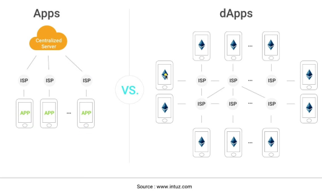

#### 2. Decentralized Social Media
- Example: Orb
- You own your data
- Decentralized platform
  - 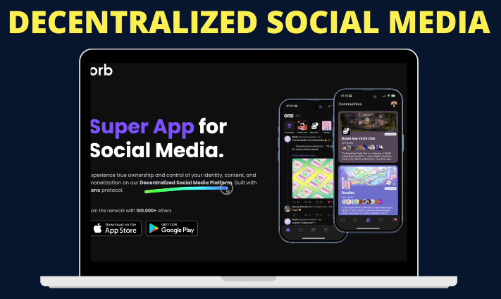

#### 3. DAOs (Decentralized Autonomous Organizations)
- No top-level CEOs/co-founders
- Holders of NFT collection or tokens make decisions
- Process:
  - Holders create proposals
  - Other holders vote
  - If approved, proposal becomes a contract
  - Organization executes the proposal
    - 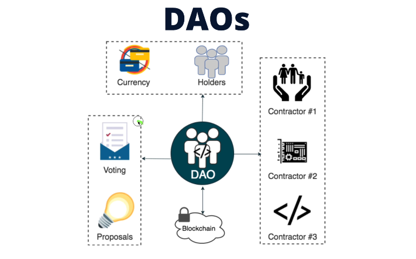

#### 4. NFTs (Non-Fungible Tokens)
- Digital assets on blockchain
- Can be used as:
  - Profile pictures (PFPs)
  - Access to applications
- Example: Azuki collection
- You own your digital assets
  - 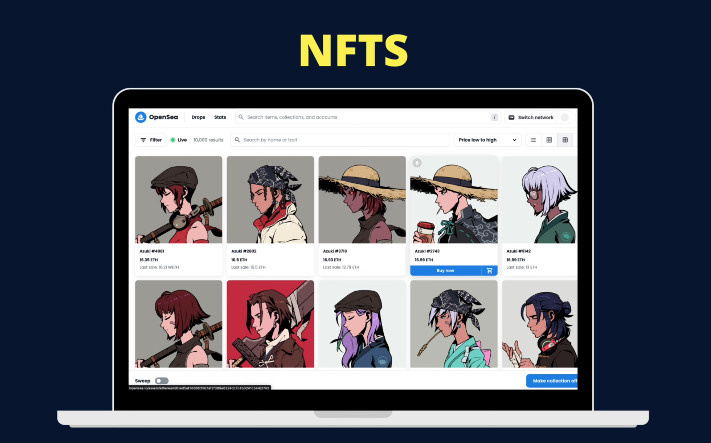

#### 5. Cryptocurrencies
- Create your own coin (like Ethereum, Bitcoin, Dogecoin)
- Use in your own platform
- Provide benefits to holders
  - 

#### 6. Games
- Build gaming characters on blockchain
- You own the characters
- Can sell characters after leveling up
- Find items in-game and sell them
- Monetize your gameplay
- True ownership of in-game assets
  - 

### Why Blockchain Development?

#### Ownership
- **You own the data**
- You are in control
- Nobody else has access

#### Salary
- Blockchain developers: $110,000 - $250,000/year
- Solidity developers on LinkedIn: $120,000 - $200,000/year

## Web2 vs Web3

### Web2 (Traditional)
- User → Application (Facebook) → Server/Database
- Data stored on centralized servers
- Company controls your data
  - 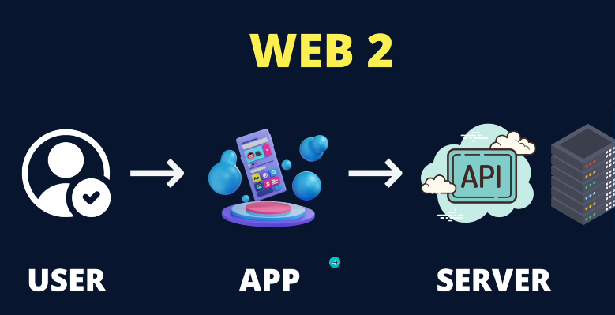

### Web3 (Blockchain)
- User → Sign in with crypto wallet
- Crypto wallet → DApp
- DApp → Blockchain
- Data saved on blockchain
- Distributed across different servers worldwide
- You control your own data
  - 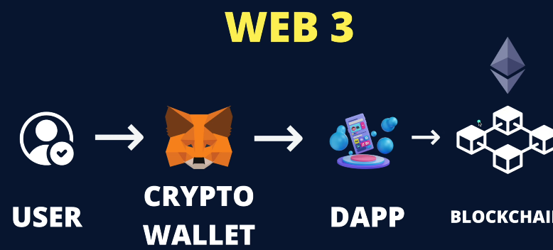

## Hello World: Getting Started with Remix IDE

### Setup
1. Go to Google and search "Remix IDE"
2. Click on [remix.ethereum.org](https://remix.ethereum.org)
3. Create new workspace (click + button) or download for linux
4. Name it: "Solidity Learning" or any name
5. Three folders appear: contract, script, test

### Creating Your First Contract

#### File Creation
1. Right-click on "contracts" folder
2. Click "New File"
3. Name it: `hello.sol`

#### Basic Contract Structure

```solidity
// SPDX-License-Identifier: MIT
pragma solidity 0.8.0;

contract Hello {
    string public welcome = "Hello World";
}
```

**Components:**
- **SPDX(Software Package Data Exchange) License**: Specifies who can use the code (MIT = open source)
- **Pragma**: Specifies compiler version, which compiler is gonna convert .sol → executables
- **Contract**: Keyword to create a contract
- **Variable**: `string public welcome` - public variable anyone can see

### Deploying Your First Contract

1. Click Solidity Compiler icon (left sidebar)
2. Check compiler version matches your code
3. Click "Deploy & Run Transactions" icon
4. Environment: Select "Remix VM (Merge)"
5. Click "Deploy" button
6. Contract appears at bottom
7. Click variable name to see value

- Remix IDE: Hello World !!!
  - Online
    - 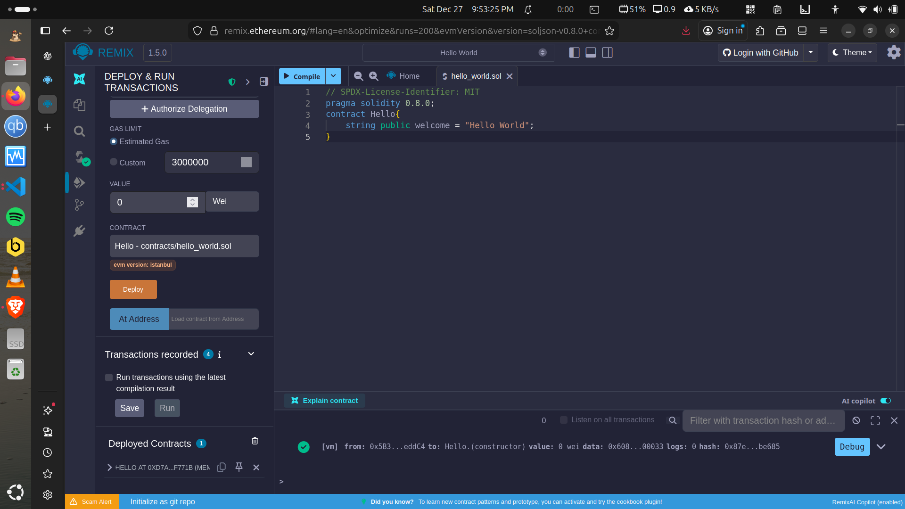
  - Offline
    - 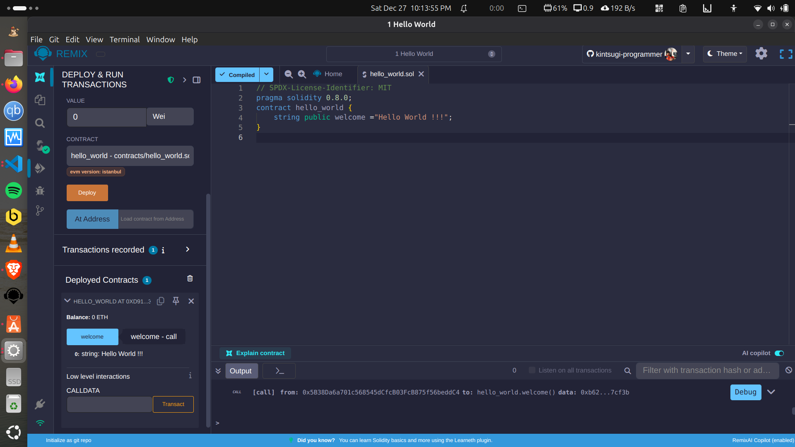

## Getting Started with Solidity in VS Code + HardHat

### Prerequisites
- Visual Studio Code installed
- Node.js LTS installed

Check versions:

```bash
node -v
npm -v
```

---

### Step 1 — Install Solidity Extension in VS Code

1. Open VS Code
2. Go to Extensions (square icon on left)
3. Search: **Solidity**
4. Install the extension by **Juan Blanco** or [**HardHat Official**](https://marketplace.visualstudio.com/items?itemName=NomicFoundation.hardhat-solidity)

---

### Step 2 — Create Project Folder

```bash
mkdir 2_my_solidity_project
cd 2_my_solidity_project
```

Initialize npm:

```bash
npm init -y
```

```bash
bali-king@war-machine:~/BaliGit/kintsugi-stack-web3/SOLIDITY/2_my_solidity_project$ npm init -y
Wrote to /home/bali-king/BaliGit/kintsugi-stack-web3/SOLIDITY/2_my_solidity_project/package.json:

{
  "name": "2_my_solidity_project",
  "version": "1.0.0",
  "description": "",
  "main": "index.js",
  "scripts": {
    "test": "echo \"Error: no test specified\" && exit 1"
  },
  "keywords": [],
  "author": "",
  "license": "ISC",
  "type": "commonjs"
}


bali-king@war-machine:~/BaliGit/kintsugi-stack-web3/SOLIDITY/2_my_solidity_project$ 
```

---

### Step 3 — Install Hardhat

```bash
npm install --save-dev hardhat
```

Create Hardhat project:

```bash
npx hardhat --init
```

Choose:

1. **Create a JavaScript project**
2. Press **Enter** for default location
3. Type **y** to install recommended packages

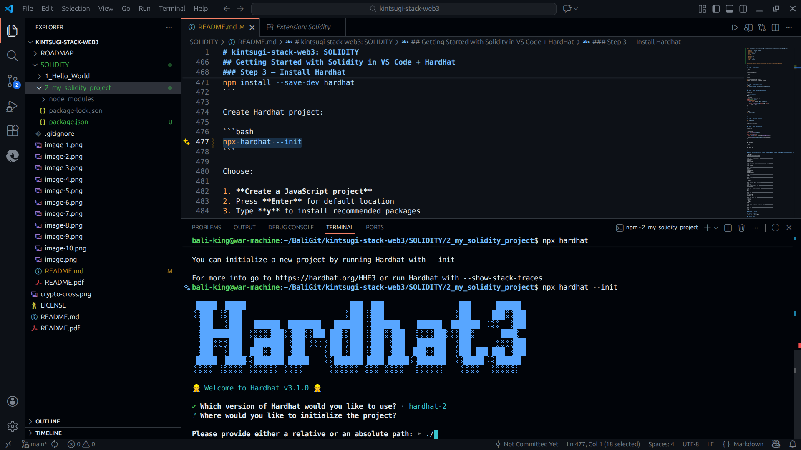

> for packages install errors: use `--legacy-peer-deps`
```bash
npm error Fix the upstream dependency conflict, or retry
npm error this command with --force or --legacy-peer-deps
npm error to accept an incorrect (and potentially broken) dependency resolution.
```

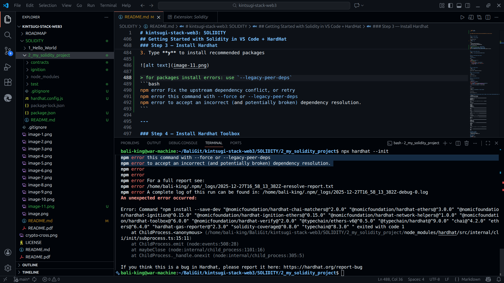

> or Downgrade Hardhat to v2 (recommended)
```bash
npm remove hardhat
npm install --save-dev hardhat@^2.28.0
rm -rf node_modules package-lock.json
npm install
npm install --save-dev \
  @nomicfoundation/hardhat-chai-matchers@^2.0.0 \
  @nomicfoundation/hardhat-ethers@^3.1.3 \
  @nomicfoundation/hardhat-ignition@^0.15.0 \
  @nomicfoundation/hardhat-ignition-ethers@^0.15.0 \
  @nomicfoundation/hardhat-network-helpers@^1.0.0 \
  @nomicfoundation/hardhat-toolbox@^6.0.0 \
  @nomicfoundation/hardhat-verify@^2.0.0 \
  @typechain/ethers-v6@^0.5.0 \
  @typechain/hardhat@^9.0.0 \
  chai@^4.2.0 \
  ethers@^6.4.0 \
  hardhat-gas-reporter@^2.3.0 \
  solidity-coverage@^0.8.0 \
  typechain@^8.3.0

```

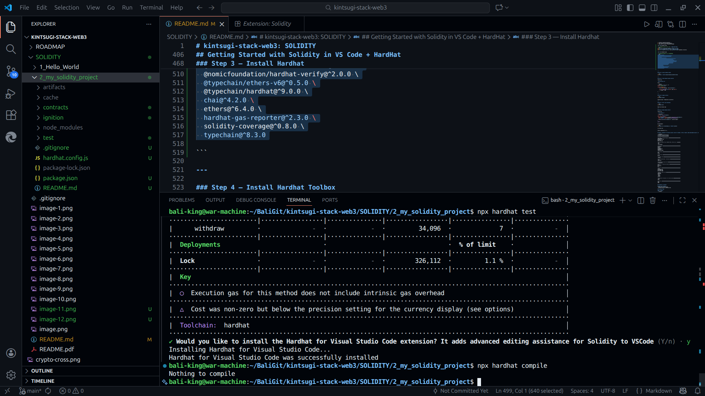

---

### Step 4 — Install Hardhat Toolbox

```bash
npm install --save-dev @nomicfoundation/hardhat-toolbox
```

---

### Step 5 — Create Sample Solidity Contract

Create file:

`contracts/Hello.sol`

Paste:

```solidity
// SPDX-License-Identifier: MIT
pragma solidity ^0.8.0;

contract HelloWorld {
    string public message = "Hello Blockchain!";

    function setMessage(string memory _msg) public {
        message = _msg;
    }
}
```

---

### Step 6 — Compile Contract

```bash
npx hardhat compile
```

Expected output: **Compilation successful**

---

### Step 7 — Start Local Blockchain

```bash
npx hardhat node
```

Keep this terminal open

---

### Step 8 — Deploy Sample Contract

Create file:

`scripts/deploy.js`

```javascript
const hre = require("hardhat");

async function main() {
  const HelloWorld = await hre.ethers.deployContract("HelloWorld");
  const contract = await HelloWorld.waitForDeployment();

  console.log("Contract deployed at:", contract.target);
}

main();
```

Run deployment:

```bash
npx hardhat run scripts/deploy.js --network localhost
```

You should see:

```
Contract deployed at: 0x....
```

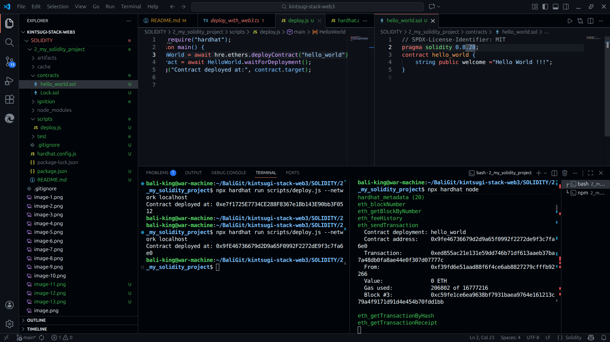

## General .gitignore for Solidity projects (works for Hardhat, Truffle, Foundry, Remix-downloaded projects, etc.)

```gitignore
##############################
# UNIVERSAL SOLIDITY GITIGNORE
##############################

# ─── Node / Package Managers ────────────────────────────────
node_modules/
package-lock.json
yarn.lock
pnpm-lock.yaml

# ─── Environment Files (PRIVATE KEYS, RPC URL etc.) ─────────
.env
.env.*
!.env.example

# ─── Hardhat ────────────────────────────────────────────────
artifacts/
cache/
coverage/
coverage.json
typechain/
typechain-types/

# ─── Foundry ────────────────────────────────────────────────
out/
cache/

# ─── Truffle ────────────────────────────────────────────────
build/

# ─── Remix IDE ──────────────────────────────────────────────
.states/

# ─── Generated ABIs / Interfaces ────────────────────────────
*.abi
*.abi.json

# ─── TypeScript build info ──────────────────────────────────
*.tsbuildinfo

# ─── Dist / Production Bundles ──────────────────────────────
dist/
out-build/
bin/

# ─── Logs ───────────────────────────────────────────────────
*.log
npm-debug.log*
yarn-debug.log*
yarn-error.log*

# ─── OS / Editor Junk ───────────────────────────────────────
.DS_Store
Thumbs.db
*.swp
.idea/
.vscode/
*.iml

# ─── Python virtualenvs (if scripts used) ───────────────────
.venv/
venv/

# ─── Misc ───────────────────────────────────────────────────
tmp/
temp/
```

## Variables in Solidity

### What Are Variables?
- Store data in your program
- Different types for different data

### Variable Types

#### 1. Address
```solidity
address public owner;
```
- Stores Ethereum addresses
- Could be wallet address or smart contract address

#### 2. String
```solidity
string public name = "Nas";
```
- Represents text
- Must use quotes

#### 3. Boolean
```solidity
bool public isActive = true;
```
- Only two values: `true` or `false`
- Used for conditions (if this then that)

#### 4. Unsigned Integers (uint)

**Different Sizes:**
```solidity
uint8 public maxSupply = 255;          // Max: 255
uint16 public count = 65000;           // Max: 65,535
uint128 public largeNum;               // Very large number
uint256 public veryLargeNum;           // Extremely large number
```

**Why Different Sizes?**
- Larger numbers take more memory
- Choose size based on maximum value needed
- Example: `uint8` for small numbers (0-255)
- Example: `uint256` for timestamps or large values

**Timestamp Example:**
```solidity
uint256 public waitTime = 1 days; // Represents 86400 (seconds in one day)
```

## Building a Calculator Contract

### Requirements
1. Create contract called "Calculator"
2. Create result variable to store result
3. Create three functions: add, subtract, multiply
4. Create function to get result
5. Deploy smart contract

### Complete Calculator Code

```solidity
// SPDX-License-Identifier: MIT
pragma solidity 0.8.0;

contract Calculator {
    uint256 public result = 0;
    
    function add(uint256 num) public {
        result += num;
    }
    
    function subtract(uint256 num) public {
        result -= num;
    }
    
    function multiply(uint256 num) public {
        result *= num;
    }
    
    function get() public view returns (uint256) {
        return result;
    }
}
```

### Functions Explained

#### Function Structure
```solidity
function functionName(parameters) visibility returns (returnType) {
    // logic here
}
```

**Components:**
- **function**: Keyword to declare function
- **functionName**: Name you give it
- **parameters**: Input values (in parentheses)
- **visibility**: public, private, external, internal
- **returns**: What type of data it returns (optional)
- **logic**: Code inside curly brackets

#### Add Function
```solidity
function add(uint256 num) public {
    result += num;
}
```
- Takes `num` parameter
- Adds `num` to result
- `result += num` same as `result = result + num`

#### Get Function
```solidity
function get() public view returns (uint256) {
    return result;
}
```
- No parameters (empty parentheses)
- `view`: Only reads data, doesn't modify
- Returns uint256 value
- Simply returns current result

### Testing the Calculator

**Deploy Steps:**
1. Compile contract
2. Click "Deploy & Run Transactions"
3. Select "Remix VM"
4. Click "Deploy"
5. Contract appears at bottom

**Testing:**
- Add 5: Input 5, click "add" → result = 5
- Multiply 10: Input 10, click "multiply" → result = 50
- Subtract 10: Input 10, click "subtract" → result = 40
- Click "get" to see current result

## Deploying to Blockchain

### Prerequisites

#### Install MetaMask
1. Search "MetaMask" in Google
2. Download for Chrome
3. Complete installation
4. Pin extension to toolbar

#### Setup Test Network
1. Click MetaMask icon
2. Go to Settings → Advanced
3. Enable "Show test networks"
4. Select Sepolia test network

#### Get Test Coins
1. Search "Sepolia faucet"
2. Go to Alchemy Sepolia faucet
3. Log in/sign up
4. Copy your wallet address from MetaMask
5. Paste address, verify "I'm not a robot"
6. Click "Send me ETH"
7. Wait for 0.5 Sepolia ETH (test coins, not real money)

### Deployment Process

**In Remix:**
1. Go to "Deploy & Run Transactions"
2. Environment: Select "Injected Provider - MetaMask"
3. MetaMask popup appears
4. Select account to use
5. Click "Next" then "Connect"
6. Should see "Sepolia" in Remix
7. Click "Deploy"
8. MetaMask asks for confirmation
9. Click "Confirm"
10. Click "View on Etherscan" to see on blockchain

### Interacting with Deployed Contract

**In Remix:**
- Functions appear under deployed contract
- Example: Add 5, click "transact"
- MetaMask asks for confirmation (costs gas)
- Click "Confirm"
- View transaction on Etherscan

**Reading vs Writing:**
- **Reading** (like `get`): Free, no gas fees
- **Writing** (like `add`, `subtract`): Costs gas fees
- State changes require payment
- Getting data is free

## Visibility Modifiers

### Four Types of Visibility

#### 1. Public
```solidity
function add(uint256 num) public {
    result += num;
}
```
- Can be used internally and externally
- Anyone can call it
- Your MetaMask account can use it
- Other contracts can use it

#### 2. Private
```solidity
function internalCalc() private {
    // logic
}
```
- Only usable within the contract
- Not visible externally
- Cannot be called by users or other contracts
- Only used by code inside the contract

#### 3. Internal
```solidity
function helperFunction() internal {
    // logic
}
```
- Usable within the contract
- Usable by inheriting contracts
- Not usable externally (not by MetaMask)
- Child contracts can access it

**Example:**
```solidity
contract BasicCalculator {
    uint256 internal result;
    
    function add(uint256 num) internal {
        result += num;
    }
}

contract AdvancedCalculator is BasicCalculator {
    function multiply(uint256 num) internal {
        result *= num;
    }
    
    function performOperation() public {
        add(5);  // Can use parent's internal function
        multiply(2);
    }
}
```

#### 4. External
```solidity
function add(uint256 num) external {
    result += num;
}
```
- Only accessible from external contracts/accounts
- Cannot be used internally within the contract
- More gas efficient than public
- Use when function is only for external calls

**When to Use External:**
- Function will only be called externally
- Saves gas fees
- Compiler doesn't need to make it internally accessible

### Inheritance Example

```solidity
contract BasicCalculator {
    uint256 internal result;
    
    function add(uint256 num) internal {
        result += num;
    }
    
    function subtract(uint256 num) internal {
        result -= num;
    }
}

contract AdvancedCalculator is BasicCalculator {
    function multiply(uint256 num) internal {
        result *= num;
    }
    
    function divide(uint256 num) internal {
        result /= num;
    }
    
    function performOperation(uint256 x) public {
        add(x);      // From parent contract
        subtract(5); // From parent contract
        multiply(2); // From this contract
    }
}
```

## Twitter Smart Contract - Basic Version

### Requirements
1. Create Twitter contract
2. Create mapping between user and tweet
3. Create function to create tweet
4. Create function to get tweet

### What is a Mapping?

**Concept:**
- Think of it like hangers and clothes
- Hanger = Key (Monday, Tuesday, Wednesday)
- Clothes on hanger = Value (different shirts)

**Real Examples:**
- Student ID → Name
- Address → Balance
- Wallet Address → Tweet

**Key Points:**
- Key-value pairs
- Extremely fast at accessing data
- Keys are unique
- Values can be any type

### Mapping Syntax

```solidity
mapping(address => string) public tweets;
```

- `mapping`: Keyword
- `address`: Key type (wallet address)
- `string`: Value type (tweet text)
- `public`: Visibility
- `tweets`: Variable name

### Complete Basic Twitter Contract

```solidity
// SPDX-License-Identifier: MIT
pragma solidity 0.8.0;

contract Twitter {
    mapping(address => string) public tweets;
    
    function createTweet(string memory _tweet) public {
        tweets[msg.sender] = _tweet;
    }
    
    function getTweet(address _owner) public view returns (string memory) {
        return tweets[_owner];
    }
}
```

### Key Concepts

#### msg.sender
```solidity
tweets[msg.sender] = _tweet;
```
- Automatically provided by blockchain
- Represents wallet address of caller
- Part of `message` object
- Contains information about transaction

#### Memory Keyword
```solidity
function createTweet(string memory _tweet) public {
```
- Required for complex types (strings, arrays)
- Stores data temporarily
- Cleared after function execution
- Tells Solidity where to store data

### Testing the Contract

**Deploy:**
1. Compile contract
2. Deploy to Remix VM
3. Contract appears at bottom

**Create Tweet:**
1. Input: "Hello World"
2. Click "createTweet"
3. Tweet saved on blockchain

**Get Tweet:**
1. Copy your account address
2. Paste in "getTweet" input
3. Click "call"
4. Returns: "Hello World"

## Arrays in Solidity

### What Are Arrays?
- List of things
- Collection of items
- Like bottles of honey in a row
- Like list of names

### Array Structure
```
Index:  [0]       [1]        [2]      [3]
Value:  ["Nas"]  ["Victoria"]  ["Dan"]  ["Harry Potter"]
```

**Key Points:**
- Index always starts at 0
- Increments by 1 (0, 1, 2, 3...)
- Index is like a key to access values
- Think of it as boxes within a big box

### Array Types

#### Dynamic Array (Can Grow)
```solidity
uint[] public numbers;
```
- No fixed size
- Can add unlimited elements

#### Fixed Size Array
```solidity
uint[10] public numbers;
```
- Maximum of 10 elements
- Cannot exceed specified size

#### Initialized Array
```solidity
uint[] public numbers = [1, 2, 3];
string[] public names = ["Alice", "Bob", "Charlie"];
```

### Array Operations

#### Adding to Array
```solidity
uint[] public myArray;

function addValue(uint value) public {
    myArray.push(value);
}
```

#### Getting from Array
```solidity
function getValue(uint index) public view returns (uint) {
    return myArray[index];
}
```

#### Getting Length
```solidity
function getLength() public view returns (uint) {
    return myArray.length;
}
```

### Complete Array Example

```solidity
// SPDX-License-Identifier: MIT
pragma solidity 0.8.0;

contract ArrayExample {
    uint[] public dynamicArray;
    uint[10] public fixedArray;
    string[] public names = ["Alice", "Bob", "Charlie"];
    
    function addToArray(uint value) public {
        dynamicArray.push(value);
    }
    
    function getArrayValue(uint index) public view returns (uint) {
        return dynamicArray[index];
    }
    
    function getArrayLength() public view returns (uint) {
        return dynamicArray.length;
    }
}
```

## Twitter Contract - Array of Tweets

### Problem
- Current mapping only stores one tweet per address
- Users need to store multiple tweets

### Solution
Change mapping to store array of strings:

```solidity
// Before:
mapping(address => string) public tweets;

// After:
mapping(address => string[]) public tweets;
```

### Updated Twitter Contract

```solidity
// SPDX-License-Identifier: MIT
pragma solidity 0.8.0;

contract Twitter {
    mapping(address => string[]) public tweets;
    
    function createTweet(string memory _tweet) public {
        tweets[msg.sender].push(_tweet);
    }
    
    function getTweet(address _owner, uint _i) public view returns (string memory) {
        return tweets[_owner][_i];
    }
    
    function getAllTweets(address _owner) public view returns (string[] memory) {
        return tweets[_owner];
    }
}
```

### Changes Explained

#### Create Tweet
```solidity
function createTweet(string memory _tweet) public {
    tweets[msg.sender].push(_tweet);
}
```
- Instead of `= _tweet`, use `.push(_tweet)`
- Adds tweet to array
- Keeps all previous tweets

#### Get One Tweet
```solidity
function getTweet(address _owner, uint _i) public view returns (string memory) {
    return tweets[_owner][_i];
}
```
- Added index parameter `_i`
- Returns tweet at specific position
- `tweets[_owner][_i]` - first bracket for address, second for index

#### Get All Tweets
```solidity
function getAllTweets(address _owner) public view returns (string[] memory) {
    return tweets[_owner];
}
```
- Returns entire array
- `string[] memory` - returns array of strings
- No index needed

### Testing Multiple Tweets

**Create Tweets:**
1. Create tweet: "yo"
2. Create tweet: "Hello Twitter"
3. Create tweet: "This is Nas"

**Get One Tweet:**
- `getTweet(yourAddress, 0)` → "yo"
- `getTweet(yourAddress, 2)` → "This is Nas"

**Get All Tweets:**
- `getAllTweets(yourAddress)` → ["yo", "Hello Twitter", "This is Nas"]

**Error Example:**
- `getTweet(yourAddress, 10)` → Error: "revert" (index out of bounds)

## Structs in Solidity

### What Are Structs?
- Define custom data types
- Group related data together
- Like describing something with multiple properties

**Think of Describing a Car:**
- Model: Model Y
- Year: 2023
- Color: Blue
- Mileage: 15000

### Struct Syntax

```solidity
struct Tesla {
    string model;
    uint256 year;
    string color;
    uint256 mileage;
    string vin;
}
```

### Creating Struct Instances

```solidity
Tesla[] public teslas;

function addTesla(
    string memory _model,
    uint256 _year,
    string memory _color,
    uint256 _mileage,
    string memory _vin
) public {
    Tesla memory newTesla = Tesla({
        model: _model,
        year: _year,
        color: _color,
        mileage: _mileage,
        vin: _vin
    });
    
    teslas.push(newTesla);
}
```

### Key Points
- Use `memory` keyword when creating struct instance
- Specify key-value pairs
- Can store in array or mapping
- Acts like a custom data type

## Twitter Contract - Adding Structs

### Requirements
1. Define Tweet struct with: author, content, timestamp, likes
2. Add struct to array
3. Test tweet creation

### Tweet Struct Definition

```solidity
struct Tweet {
    address author;
    string content;
    uint256 timestamp;
    uint256 likes;
}
```

### Updated Mapping

```solidity
// Before:
mapping(address => string[]) public tweets;

// After:
mapping(address => Tweet[]) public tweets;
```

### Updated Create Tweet Function

```solidity
function createTweet(string memory _tweet) public {
    Tweet memory newTweet = Tweet({
        author: msg.sender,
        content: _tweet,
        timestamp: block.timestamp,
        likes: 0
    });
    
    tweets[msg.sender].push(newTweet);
}
```

#### Explanation
- **author**: `msg.sender` (wallet address of creator)
- **content**: `_tweet` (tweet text)
- **timestamp**: `block.timestamp` (current blockchain time)
- **likes**: `0` (initially no likes)
- **memory**: Stores struct temporarily during function

#### block.timestamp
- Provided by blockchain
- Current time in seconds (Unix timestamp)
- Automatically available

### Updated Get Functions

```solidity
function getTweet(address _owner, uint _i) public view returns (Tweet memory) {
    return tweets[_owner][_i];
}

function getAllTweets(address _owner) public view returns (Tweet[] memory) {
    return tweets[_owner];
}
```

**Changes:**
- Return type changed from `string` to `Tweet`
- Return type changed from `string[]` to `Tweet[]`

### Testing with Structs

**Create Tweet:**
1. Input: "yo"
2. Click "createTweet"
3. Transaction confirmed

**Get Tweet:**
1. Input: your address, index 0
2. Click "getTweet"
3. Returns tuple:
   - address (author)
   - "yo" (content)
   - timestamp number
   - 0 (likes)

**Data appears as tuple** (comma-separated values) containing all struct fields.

## Require Statements

### What is Require?
- Creates conditions in your code
- If condition is true: continue execution
- If condition is false: stop and revert

**Visual Analogy:**
- Gandalf saying "You shall not pass!"
- Sets up a checkpoint
- Either you pass or you don't

### Require Syntax

```solidity
require(condition, "Error message");
```

**Two Parts:**
1. **Condition**: Must evaluate to true/false
2. **Error message**: Displayed if condition fails

### Example: Limiting NFT Mints

```solidity
function mint(uint _amount) public {
    require(_amount <= 3, "No more than 3 allowed");
    
    // Mint NFTs
    // This code only runs if require passes
}
```

**How it works:**
- User tries to mint 1: ✓ Passes (1 ≤ 3)
- User tries to mint 4: ✗ Fails → "No more than 3 allowed"

## Twitter Contract - Character Limit

### Goal
Limit tweets to 280 characters

### Steps
1. Create constant for max length
2. Add require statement to check length

### Implementation

```solidity
// SPDX-License-Identifier: MIT
pragma solidity 0.8.0;

contract Twitter {
    uint16 public constant MAX_TWEET_LENGTH = 280;
    
    mapping(address => Tweet[]) public tweets;
    
    struct Tweet {
        address author;
        string content;
        uint256 timestamp;
        uint256 likes;
    }
    
    function createTweet(string memory _tweet) public {
        require(bytes(_tweet).length <= MAX_TWEET_LENGTH, "Tweet is too long");
        
        Tweet memory newTweet = Tweet({
            author: msg.sender,
            content: _tweet,
            timestamp: block.timestamp,
            likes: 0
        });
        
        tweets[msg.sender].push(newTweet);
    }
    
    function getTweet(address _owner, uint _i) public view returns (Tweet memory) {
        return tweets[_owner][_i];
    }
    
    function getAllTweets(address _owner) public view returns (Tweet[] memory) {
        return tweets[_owner];
    }
}
```

### Key Concepts

#### Constant Variable
```solidity
uint16 public constant MAX_TWEET_LENGTH = 280;
```
- **constant**: Value cannot be changed
- More gas efficient
- Use UPPERCASE naming convention
- **uint16**: 280 fits in uint16 (max 65,535)

#### bytes().length
```solidity
require(bytes(_tweet).length <= MAX_TWEET_LENGTH, "Tweet is too long");
```
- **bytes(_tweet)**: Converts string to bytes
- **.length**: Gets number of bytes
- 1 byte ≈ 1 character (in ASCII)
- Checks if tweet length ≤ 280

#### Why bytes?
- Strings don't have `.length` property in Solidity
- Must convert to bytes first
- Measures storage space (not perfect character count)

### Testing Character Limit

**Valid Tweet:**
```
Input: "yo"
Result: ✓ Success (2 characters)
```

**Invalid Tweet:**
```
Input: 400 characters of lorem ipsum
Result: ✗ Error: "Tweet is too long"
```

### Improved Get Tweet Function

**Previous Version:**
```solidity
function getTweet(address _owner, uint _i) public view returns (Tweet memory)
```

**Improved Version:**
```solidity
function getTweet(uint _i) public view returns (Tweet memory) {
    return tweets[msg.sender][_i];
}
```

**Changes:**
- Removed `_owner` parameter
- Use `msg.sender` instead
- User automatically gets their own tweets
- Simpler to use

**Testing:**
```
getTweet(0) → Returns your first tweet
getTweet(1) → Returns your second tweet
```

## Modifiers in Solidity

### What Are Modifiers?
- Building blocks for functions
- Add behavior to functions
- Reusable code
- Like adding a room to a house

**Visual Analogy:**
- In World of Warcraft, you build on top of existing structures
- Start with a house, add rooms, add castle
- Modifiers add functionality on top of functions

### Modifier Structure

```solidity
modifier modifierName() {
    // Pre-execution code
    require(condition, "Error message");
    _;  // Function code runs here
    // Post-execution code (optional)
}
```

**Key Elements:**
1. **modifier**: Keyword
2. **modifierName**: Name you give it
3. **require/logic**: Checks or operations
4. **underscore (_)**: Where function code executes
5. **Post-code**: Runs after function (optional)

### Example: Only Owner Modifier

```solidity
contract MyContract {
    address public owner;
    
    constructor() {
        owner = msg.sender;
    }
    
    modifier onlyOwner() {
        require(msg.sender == owner, "You are not the owner");
        _;
    }
    
    function changeOwner(address _newOwner) public onlyOwner {
        owner = _newOwner;
    }
}
```

**How it works:**
1. `onlyOwner` checks if caller is owner
2. If true: execute function code (at `_`)
3. If false: revert with error message

### Constructor Explained

```solidity
constructor() {
    owner = msg.sender;
}
```
- **constructor**: Special function
- Runs ONLY ONCE when contract deployed
- Sets initial owner to deployer
- Cannot be called again

### Exercise: Pausable Token

**File:** `modifiers_exercise.sol`

**Requirements:**
1. Implement modifier to allow only owner
2. Implement modifier to check if contract is not paused
3. Use `notPaused` modifier in transfer function

**Starting Code:**
```solidity
contract PausableToken {
    address public owner;
    bool public paused;
    mapping(address => uint) public balances;
    
    constructor() {
        owner = msg.sender;
        paused = false;
        balances[owner] = 1000;
    }
    
    modifier onlyOwner() {
        // TODO: Implement
    }
    
    modifier notPaused() {
        // TODO: Implement
    }
    
    function pause() public onlyOwner {
        paused = true;
    }
    
    function unpause() public onlyOwner {
        paused = false;
    }
    
    function transfer(address _to, uint _amount) public {
        // TODO: Add notPaused modifier
        require(balances[msg.sender] >= _amount, "Insufficient balance");
        balances[msg.sender] -= _amount;
        balances[_to] += _amount;
    }
}
```

**Solution:**

```solidity
contract PausableToken {
    address public owner;
    bool public paused;
    mapping(address => uint) public balances;
    
    constructor() {
        owner = msg.sender;
        paused = false;
        balances[owner] = 1000;
    }
    
    modifier onlyOwner() {
        require(msg.sender == owner, "You are not the owner");
        _;
    }
    
    modifier notPaused() {
        require(paused == false, "Contract is paused");
        _;
    }
    
    function pause() public onlyOwner {
        paused = true;
    }
    
    function unpause() public onlyOwner {
        paused = false;
    }
    
    function transfer(address _to, uint _amount) public notPaused {
        require(balances[msg.sender] >= _amount, "Insufficient balance");
        balances[msg.sender] -= _amount;
        balances[_to] += _amount;
    }
}
```

### Testing the Pausable Token

**Initial State:**
1. Deploy contract
2. Check `paused` → false
3. Check `owner` → deployer address (0xedc4...)
4. Check `balances(owner)` → 1000

**Transfer Tokens:**
1. Get second account address (0x35cb2...)
2. Transfer 100 to second account
3. Check balances:
   - Owner: 900
   - Second account: 100

**Pause Contract:**
1. Try to pause from second account → ✗ "You are not the owner"
2. Switch back to owner account
3. Pause contract → ✓ Success
4. Check `paused` → true
5. Try to transfer → ✗ "Contract is paused"

**Unpause Contract:**
1. Unpause contract → ✓ Success
2. Check `paused` → false
3. Transfer works again → ✓ Success

### Benefits of Modifiers
- **Reusability**: Write once, use many times
- **Readability**: Clear function requirements
- **Security**: Consistent access control
- **Gas Efficiency**: Cleaner code

## Twitter Contract - Change Tweet Length

### Requirements
1. Add function to change max tweet length
2. Create constructor to set owner
3. Create onlyOwner modifier
4. Use modifier on change function

### Implementation

```solidity
// SPDX-License-Identifier: MIT
pragma solidity 0.8.0;

contract Twitter {
    uint16 public MAX_TWEET_LENGTH = 280;
    address public owner;
    
    mapping(address => Tweet[]) public tweets;
    
    struct Tweet {
        address author;
        string content;
        uint256 timestamp;
        uint256 likes;
    }
    
    constructor() {
        owner = msg.sender;
    }
    
    modifier onlyOwner() {
        require(msg.sender == owner, "You are not the owner");
        _;
    }
    
    function changeTweetLength(uint16 _newLength) public onlyOwner {
        MAX_TWEET_LENGTH = _newLength;
    }
    
    function createTweet(string memory _tweet) public {
        require(bytes(_tweet).length <= MAX_TWEET_LENGTH, "Tweet is too long");
        
        Tweet memory newTweet = Tweet({
            author: msg.sender,
            content: _tweet,
            timestamp: block.timestamp,
            likes: 0
        });
        
        tweets[msg.sender].push(newTweet);
    }
    
    function getTweet(uint _i) public view returns (Tweet memory) {
        return tweets[msg.sender][_i];
    }
    
    function getAllTweets(address _owner) public view returns (Tweet[] memory) {
        return tweets[_owner];
    }
}
```

### Changes Explained

#### Removed constant
```solidity
// Before:
uint16 public constant MAX_TWEET_LENGTH = 280;

// After:
uint16 public MAX_TWEET_LENGTH = 280;
```
- Removed `constant` so value can be changed
- Still public so anyone can read it

#### Added Owner
```solidity
address public owner;

constructor() {
    owner = msg.sender;
}
```
- Stores contract owner
- Set in constructor to deployer

#### Only Owner Modifier
```solidity
modifier onlyOw() {
    require(msg.sender == owner, "You are not the owner");
    _;
}
```
- Checks if caller is owner
- Used to protect admin functions

#### Change Tweet Length
```solidity
function changeTweetLength(uint16 _newLength) public onlyOwner {
    MAX_TWEET_LENGTH = _newLength;
}
```
- Only owner can call
- Updates maximum tweet length
- Takes uint16 parameter

### Testing

**Initial State:**
1. Deploy contract
2. Check `MAX_TWEET_LENGTH` → 280
3. Check `owner` → your address

**Change Length as Owner:**
1. Call `changeTweetLength(300)`
2. Check `MAX_TWEET_LENGTH` → 300 ✓

**Try as Non-Owner:**
1. Switch to different account
2. Call `changeTweetLength(400)`
3. Error: "You are not the owner" ✗

## Adding Likes to Twitter Contract

### Requirements
1. Add ID to Tweet struct
2. Set ID to tweet array length
3. Add function to like tweet
4. Add function to unlike tweet
5. Make both functions external

### Updated Tweet Struct

```solidity
struct Tweet {
    uint256 id;
    address author;
    string content;
    uint256 timestamp;
    uint256 likes;
}
```

### Updated Create Tweet

```solidity
function createTweet(string memory _tweet) public {
    require(bytes(_tweet).length <= MAX_TWEET_LENGTH, "Tweet is too long");
    
    Tweet memory newTweet = Tweet({
        id: tweets[msg.sender].length,  // New: Set ID
        author: msg.sender,
        content: _tweet,
        timestamp: block.timestamp,
        likes: 0
    });
    
    tweets[msg.sender].push(newTweet);
}
```

**ID Explained:**
- `tweets[msg.sender].length` gives current array length
- If 3 tweets exist (indices 0, 1, 2), length is 3
- New tweet gets ID of 3, becomes index 3
- Creates unique ID for each tweet

### Like Tweet Function

```solidity
function likeTweet(address _author, uint256 _id) external {
    require(tweets[_author][_id].id == _id, "Tweet does not exist");
    tweets[_author][_id].likes++;
}
```

**Parameters:**
- `_author`: Address of tweet author
- `_id`: ID of tweet to like

**Logic:**
1. Check tweet exists (ID matches)
2. Increment likes by 1
3. `likes++` same as `likes = likes + 1`

### Unlike Tweet Function

```solidity
function unlikeTweet(address _author, uint256 _id) external {
    require(tweets[_author][_id].id == _id, "Tweet does not exist");
    require(tweets[_author][_id].likes > 0, "Tweet has no likes");
    tweets[_author][_id].likes--;
}
```

**Additional Check:**
- Must have likes > 0
- Prevents negative likes
- `likes--` decrements by 1

### Why External?
- Functions only called from outside contract
- Not used internally
- More gas efficient than public
- Tells compiler: "This is for external use only"

### Testing Likes

**Setup:**
1. Deploy contract
2. Create tweet: "yo what's up"
3. Transaction confirmed

**Like Tweet:**
1. Copy your address
2. Call `likeTweet(yourAddress, 0)`
3. Confirm transaction
4. Check tweet: likes = 1

**Like from Different Account:**
1. Switch MetaMask account
2. Like same tweet (use original author's address)
3. Check tweet: likes = 2

**Unlike Tweet:**
1. Call `unlikeTweet(authorAddress, 0)`
2. Confirm transaction
3. Check tweet: likes = 1

**Error Cases:**
- Wrong ID → "Tweet does not exist"
- Unlike when likes = 0 → "Tweet has no likes"

### Complete Twitter Contract So Far

```solidity
// SPDX-License-Identifier: MIT
pragma solidity 0.8.0;

contract Twitter {
    uint16 public MAX_TWEET_LENGTH = 280;
    address public owner;
    
    mapping(address => Tweet[]) public tweets;
    
    struct Tweet {
        uint256 id;
        address author;
        string content;
        uint256 timestamp;
        uint256 likes;
    }
    
    constructor() {
        owner = msg.sender;
    }
    
    modifier onlyOwner() {
        require(msg.sender == owner, "You are not the owner");
        _;
    }
    
    function changeTweetLength(uint16 _newLength) public onlyOwner {
        MAX_TWEET_LENGTH = _newLength;
    }
    
    function createTweet(string memory _tweet) public {
        require(bytes(_tweet).length <= MAX_TWEET_LENGTH, "Tweet is too long");
        
        Tweet memory newTweet = Tweet({
            id: tweets[msg.sender].length,
            author: msg.sender,
            content: _tweet,
            timestamp: block.timestamp,
            likes: 0
        });
        
        tweets[msg.sender].push(newTweet);
    }
    
    function likeTweet(address _author, uint256 _id) external {
        require(tweets[_author][_id].id == _id, "Tweet does not exist");
        tweets[_author][_id].likes++;
    }
    
    function unlikeTweet(address _author, uint256 _id) external {
        require(tweets[_author][_id].id == _id, "Tweet does not exist");
        require(tweets[_author][_id].likes > 0, "Tweet has no likes");
        tweets[_author][_id].likes--;
    }
    
    function getTweet(uint _i) public view returns (Tweet memory) {
        return tweets[msg.sender][_i];
    }
    
    function getAllTweets(address _owner) public view returns (Tweet[] memory) {
        return tweets[_owner];
    }
}
```

## Events in Solidity

### What Are Events?
- Notifications for the blockchain
- Logs of what happened
- Stored on blockchain
- Frontend apps can listen to them

**Visual Analogy:**
- Like phone notifications
- App notifies you when something happens
- Events notify blockchain when action occurs

### How Events Work

**Flow:**
1. Frontend App → Calls Smart Contract Function
2. Smart Contract → Executes Function
3. Smart Contract → Emits Event
4. Event → Stored on Blockchain
5. Frontend App → Listens for Event
6. Frontend App → Updates UI

**Example:**
- User creates tweet
- Contract emits "TweetCreated" event
- App listens for event
- App displays new tweet

### Event Syntax

#### Define Event
```solidity
event EventName(type param1, type indexed param2, type param3);
```

#### Emit Event
```solidity
emit EventName(value1, value2, value3);
```

### Indexed Parameters

```solidity
event Transfer(address indexed from, address indexed to, uint256 amount);
```

**indexed keyword:**
- Caches data for filtering
- Makes searching faster
- Can filter by indexed parameters
- Maximum 3 indexed parameters

### Real Example: Azuki Contract

**Event Definition:**
```solidity
event Transfer(address indexed from, address indexed to, uint256 indexed tokenId);
```

**Usage in Function:**
```solidity
function transfer(address to, uint256 tokenId) public {
    // Transfer logic
    emit Transfer(msg.sender, to, tokenId);
}
```

**On Etherscan:**
- Click "Events" tab
- See all Transfer events
- Shows: from address, to address, tokenId
- Can filter by indexed parameters

### Exercise: User Registration

**Requirements:**
1. Create event "NewUserRegistered"
2. Parameters: user address, username string
3. Emit event in registerUser function

**Starting Code:**
```solidity
contract SignUp {
    struct User {
        address userAddress;
        string username;
        uint age;
    }
    
    mapping(address => User) public users;
    
    // TODO: Create event
    
    function registerUser(string memory _username, uint _age) public {
        User memory newUser = User({
            userAddress: msg.sender,
            username: _username,
            age: _age
        });
        
        users[msg.sender] = newUser;
        
        // TODO: Emit event
    }
}
```

**Solution:**

```solidity
contract SignUp {
    struct User {
        address userAddress;
        string username;
        uint age;
    }
    
    mapping(address => User) public users;
    
    event NewUserRegistered(address indexed user, string username);
    
    function registerUser(string memory _username, uint _age) public {
        User memory newUser = User({
            userAddress: msg.sender,
            username: _username,
            age: _age
        });
        
        users[msg.sender] = newUser;
        
        emit NewUserRegistered(msg.sender, _username);
    }
}
```

### Deploying and Testing Events

**Deploy to Sepolia:**
1. Select "Injected Provider - MetaMask"
2. Ensure on Sepolia network
3. Have Sepolia ETH
4. Click "Deploy"
5. Confirm in MetaMask

**Register User:**
1. Call `registerUser("Nas Dumansky", 27)`
2. Confirm transaction
3. Click "View on Etherscan"

**Before Verification:**
- Method shows as unknown
- Events not readable
- Shows hex data

**Verify Contract:**
1. Click "Verify and Publish"
2. Compiler type: Single file
3. License: MIT
4. Compiler version: Match your pragma (0.8.18)
5. Copy/paste entire contract code
6. Complete captcha
7. Click "Verify and Publish"

**After Verification:**
- Code visible on Etherscan
- Events tab shows "NewUserRegistered"
- Can see: user address, username
- All data readable

### Benefits of Events
- **Logging**: Record contract activity
- **Frontend Updates**: Notify UI of changes
- **Debugging**: Track function execution
- **Data Queries**: Search historical data
- **Cost Effective**: Cheaper than storage

## Twitter Contract - Adding Events

### Requirements
1. Create event for creating tweet
2. Emit event in createTweet function
3. Create event for liking tweet
4. Emit event in likeTweet function
5. Create event for unliking tweet (bonus)

### Tweet Created Event

#### Define Event
```solidity
event TweetCreated(
    uint256 indexed id,
    address indexed author,
    string content,
    uint256 timestamp
);
```

**Indexed Parameters:**
- `id`: Can filter by tweet ID
- `author`: Can filter by author
- `content`: Not indexed (too large)
- `timestamp`: Not indexed

#### Emit Event
```solidity
function createTweet(string memory _tweet) public {
    require(bytes(_tweet).length <= MAX_TWEET_LENGTH, "Tweet is too long");
    
    Tweet memory newTweet = Tweet({
        id: tweets[msg.sender].length,
        author: msg.sender,
        content: _tweet,
        timestamp: block.timestamp,
        likes: 0
    });
    
    tweets[msg.sender].push(newTweet);
    
    emit TweetCreated(
        newTweet.id,
        newTweet.author,
        newTweet.content,
        newTweet.timestamp
    );
}
```

### Tweet Liked Event

#### Define Event
```solidity
event TweetLiked(
    address indexed liker,
    address indexed tweetAuthor,
    uint256 indexed tweetId,
    uint256 newLikeCount
);
```

**All Indexed:**
- Filter by who liked
- Filter by tweet author
- Filter by tweet ID
- `newLikeCount` not indexed (not needed for filtering)

#### Emit Event
```solidity
function likeTweet(address _author, uint256 _id) external {
    require(tweets[_author][_id].id == _id, "Tweet does not exist");
    tweets[_author][_id].likes++;
    
    emit TweetLiked(
        msg.sender,
        _author,
        _id,
        tweets[_author][_id].likes
    );
}
```

### Tweet Unliked Event

#### Define Event
```solidity
event TweetUnliked(
    address indexed unliker,
    address indexed tweetAuthor,
    uint256 indexed tweetId,
    uint256 newLikeCount
);
```

#### Emit Event
```solidity
function unlikeTweet(address _author, uint256 _id) external {
    require(tweets[_author][_id].id == _id, "Tweet does not exist");
    require(tweets[_author][_id].likes > 0, "Tweet has no likes");
    tweets[_author][_id].likes--;
    
    emit TweetUnliked(
        msg.sender,
        _author,
        _id,
        tweets[_author][_id].likes
    );
}
```

### Complete Twitter Contract with Events

```solidity
// SPDX-License-Identifier: MIT
pragma solidity 0.8.0;

contract Twitter {
    uint16 public MAX_TWEET_LENGTH = 280;
    address public owner;
    
    mapping(address => Tweet[]) public tweets;
    
    struct Tweet {
        uint256 id;
        address author;
        string content;
        uint256 timestamp;
        uint256 likes;
    }
    
    event TweetCreated(
        uint256 indexed id,
        address indexed author,
        string content,
        uint256 timestamp
    );
    
    event TweetLiked(
        address indexed liker,
        address indexed tweetAuthor,
        uint256 indexed tweetId,
        uint256 newLikeCount
    );
    
    event TweetUnliked(
        address indexed unliker,
        address indexed tweetAuthor,
        uint256 indexed tweetId,
        uint256 newLikeCount
    );
    
    constructor() {
        owner = msg.sender;
    }
    
    modifier onlyOwner() {
        require(msg.sender == owner, "You are not the owner");
        _;
    }
    
    function changeTweetLength(uint16 _newLength) public onlyOwner {
        MAX_TWEET_LENGTH = _newLength;
    }
    
    function createTweet(string memory _tweet) public {
        require(bytes(_tweet).length <= MAX_TWEET_LENGTH, "Tweet is too long");
        
        Tweet memory newTweet = Tweet({
            id: tweets[msg.sender].length,
            author: msg.sender,
            content: _tweet,
            timestamp: block.timestamp,
            likes: 0
        });
        
        tweets[msg.sender].push(newTweet);
        
        emit TweetCreated(
            newTweet.id,
            newTweet.author,
            newTweet.content,
            newTweet.timestamp
        );
    }
    
    function likeTweet(address _author, uint256 _id) external {
        require(tweets[_author][_id].id == _id, "Tweet does not exist");
        tweets[_author][_id].likes++;
        
        emit TweetLiked(
            msg.sender,
            _author,
            _id,
            tweets[_author][_id].likes
        );
    }
    
    function unlikeTweet(address _author, uint256 _id) external {
        require(tweets[_author][_id].id == _id, "Tweet does not exist");
        require(tweets[_author][_id].likes > 0, "Tweet has no likes");
        tweets[_author][_id].likes--;
        
        emit TweetUnliked(
            msg.sender,
            _author,
            _id,
            tweets[_author][_id].likes
        );
    }
    
    function getTweet(uint _i) public view returns (Tweet memory) {
        return tweets[msg.sender][_i];
    }
    
    function getAllTweets(address _owner) public view returns (Tweet[] memory) {
        return tweets[_owner];
    }
}
```

### Testing Events on Blockchain

**Deploy to Sepolia:**
1. Verify contract on Etherscan (as shown earlier)
2. Create tweet: "This is my first tweet"
3. View transaction on Etherscan
4. Click "Events" tab
5. See "TweetCreated" event with all data

**View Event Data:**
- ID: 0
- Author: Your address
- Content: "This is my first tweet"
- Timestamp: Block timestamp

## Loops in Solidity

### What Are Loops?
- Create repetitive tasks
- Execute code multiple times
- Continue while condition is true
- Stop when condition becomes false

**Visual Analogy:**
- Car moving forward while gas pedal pressed
- Stops when brake pressed
- Constantly checks: "Should I continue?"

### For Loop Structure

```solidity
for (initialization; condition; update) {
    // Code to repeat
}
```

**Three Parts:**
1. **Initialization**: Starting point (let i = 0)
2. **Condition**: When to stop (i < 5)
3. **Update**: How to change (i++)

### For Loop Example

```solidity
function sumNumbers(uint limit) public pure returns (uint) {
    uint sum = 0;
    
    for (uint i = 1; i <= limit; i++) {
        sum += i;
    }
    
    return sum;
}
```

**Execution (limit = 3):**
1. i = 1, sum = 0: sum = 0 + 1 = 1
2. i = 2, sum = 1: sum = 1 + 2 = 3
3. i = 3, sum = 3: sum = 3 + 3 = 6
4. i = 4: Stop (4 > 3)
5. Return 6

### Loop Breakdown

**i++ Explained:**
```solidity
i++    // Same as: i = i + 1
i--    // Same as: i = i - 1
sum += i  // Same as: sum = sum + i
sum -= i  // Same as: sum = sum - i
```

### Exercise: Total Expenses Calculator

**Requirements:**
- Create loop to calculate all expenses
- Return total expense amount

**Starting Code:**
```solidity
contract ExpenseTracker {
    struct Expense {
        address user;
        string description;
        uint amount;
    }
    
    Expense[] public expenses;
    
    constructor() {
        expenses.push(Expense(msg.sender, "Groceries", 50));
        expenses.push(Expense(msg.sender, "Transportation", 30));
        expenses.push(Expense(msg.sender, "Dining Out", 25));
    }
    
    function addExpense(string memory _description, uint _amount) public {
        expenses.push(Expense(msg.sender, _description, _amount));
    }
    
    function getTotalExpenses(address _user) public view returns (uint) {
        // TODO: Implement loop
    }
}
```

**Solution:**

```solidity
function getTotalExpenses(address _user) public view returns (uint) {
    uint totalExpenses = 0;
    
    for (uint i = 0; i < expenses.length; i++) {
        if (expenses[i].user == _user) {
            totalExpenses += expenses[i].amount;
        }
    }
    
    return totalExpenses;
}
```

**Explanation:**
1. Initialize `totalExpenses` to 0
2. Loop from 0 to array length
3. Check if expense belongs to user
4. If yes, add to total
5. Return total

### Testing Expense Tracker

**Deploy and Test:**
1. Deploy contract
2. Copy your address
3. Call `getTotalExpenses(yourAddress)`
4. Result: 105 (50 + 30 + 25)

**Add More Expenses:**
1. Call `addExpense("Shopping", 100)`
2. Call `getTotalExpenses(yourAddress)`
3. Result: 205

## Twitter Contract - Get Total Likes

### Requirements
1. Create function `getTotalLikes`
2. Loop over all tweets
3. Sum up total likes
4. Return total likes for user

### Implementation

```solidity
function getTotalLikes(address _author) external view returns (uint) {
    uint totalLikes = 0;
    
    for (uint i = 0; i < tweets[_author].length; i++) {
        totalLikes += tweets[_author][i].likes;
    }
    
    return totalLikes;
}
```

### Explanation

**Function Signature:**
```solidity
function getTotalLikes(address _author) external view returns (uint)
```
- `_author`: Convention to use underscore for parameters
- `external`: Only called externally (gas efficient)
- `view`: Only reads data, doesn't modify
- `returns (uint)`: Default is uint256

**Loop Logic:**
```solidity
for (uint i = 0; i < tweets[_author].length; i++)
```
- Start at 0
- Continue while i < array length
- Increment i each iteration

**Accessing Data:**
```solidity
tweets[_author][i].likes
```
- `tweets[_author]`: Gets array of tweets
- `[i]`: Gets tweet at index i
- `.likes`: Gets likes from that tweet

### Think of Data as a Tree

**Concept:**
- Data structured like tree branches
- Start at root (bottom)
- Climb branches to reach leaves (data)
- Each step gets you closer to target

**Visual:**
```
          [.likes]
              |
          [tweet at i]
              |
      [array of tweets]
              |
    [tweets[_author]]
```

**Steps to Access:**
1. Enter mapping with address: `tweets[_author]`
2. Get specific tweet: `[i]`
3. Get likes property: `.likes`

### Testing Total Likes

**Setup:**
1. Deploy contract
2. Create tweet: "yo this is Nas"
3. Like tweet (ID: 0, your address)
4. Like again

**Get Total Likes:**
1. Call `getTotalLikes(yourAddress)`
2. Result: 2

**Create More Tweets:**
1. Create second tweet
2. Like it once
3. Call `getTotalLikes(yourAddress)`
4. Result: 3 (2 from first + 1 from second)

## Inheritance in Solidity

### What is Inheritance?
- Inherit functionalities from another contract
- Parent contract → Child contract
- Child gets all parent functions
- Child can add own functions

**Visual Analogy:**
- You inherit iPhone
- Can make calls, send texts (parent functions)
- Add your own apps (child functions)

### Real-World Example

**Car vs Truck:**
- **Car**: drive(), reverse(), stop()
- **Truck**: drive(), reverse(), stop() + tow(), offRoad()
- Truck inherits from Car
- Truck adds extra functions

### Inheritance Syntax

```solidity
contract Parent {
    uint public data;
    
    function setData(uint _data) public {
        data = _data;
    }
}

contract Child is Parent {
    function doubleData() public {
        data = data * 2;
    }
}
```

**is Keyword:**
- `contract Child is Parent`
- Child inherits all Parent functions
- Child can access Parent variables

### Multiple Inheritance

```solidity
contract Ownable {
    address public owner;
    modifier onlyOwner() { _; }
}

contract Pausable {
    bool public paused;
    modifier whenNotPaused() { _; }
}

contract MyContract is Ownable, Pausable {
    // Has all functions from both contracts
}
```

### Abstract Contracts

```solidity
abstract contract Ownable {
    address public owner;
    
    modifier onlyOwner() {
        require(msg.sender == owner, "Not owner");
        _;
    }
}
```

**abstract keyword:**
- Meant for inheritance only
- Cannot deploy directly
- Must be inherited by another contract
- Used as building blocks

### Real Example: Azuki NFT

```solidity
contract Azuki is Ownable, ERC721A, ReentrancyGuard {
    // Inherits from multiple contracts
    // Each provides specific functionality
}
```

**Inherited Contracts:**
- **Ownable**: Owner management
- **ERC721A**: NFT standard
- **ReentrancyGuard**: Security

### Exercise: Multiplayer Game

**Requirements:**
1. Inherit from MultiplayerGame
2. Call parent join game function
3. Increment player count

**Starting Code:**

```solidity
// Parent Contract
contract MultiplayerGame {
    mapping(address => bool) public players;
    
    function joinGame() public virtual {
        players[msg.sender] = true;
    }
}

// Child Contract
contract Game {
    // TODO: Inherit from MultiplayerGame
    string public gameName;
    address public yourAccount;
    uint public playerCount;
    
    constructor(string memory _gameName) {
        gameName = _gameName;
        yourAccount = msg.sender;
    }
    
    function startGame() public {
        // Start game logic
    }
    
    function joinGame() public {
        // TODO: Call parent join game
        // TODO: Increment player count
    }
}
```

**Solution:**

```solidity
// Parent Contract
contract MultiplayerGame {
    mapping(address => bool) public players;
    
    function joinGame() public virtual {
        players[msg.sender] = true;
    }
}

// Child Contract
contract Game is MultiplayerGame {
    string public gameName;
    address public yourAccount;
    uint public playerCount;
    
    constructor(string memory _gameName) {
        gameName = _gameName;
        yourAccount = msg.sender;
    }
    
    function startGame() public {
        // Start game logic
    }
    
    function joinGame() public override {
        super.joinGame();  // Call parent function
        playerCount++;     // Add own functionality
    }
}
```

### Key Concepts

#### super Keyword
```solidity
super.joinGame();
```
- Calls parent contract function
- Like calling Superman's power
- Executes parent logic first
- Then continues with child logic

#### override Keyword
```solidity
function joinGame() public override {
```
- Indicates function overrides parent
- Parent must mark function as `virtual`
- Required when redefining parent function

#### virtual Keyword
```solidity
function joinGame() public virtual {
```
- Allows child contracts to override
- Makes function extendable

### Testing Game Contract

**Deploy:**
1. Select "Game" contract (not MultiplayerGame)
2. Input: "Nas Game"
3. Click "Deploy"

**View Inherited Variables:**
- `players` mapping visible
- Comes from parent contract
- Can access in child contract

**Join Game:**
1. Call `joinGame()`
2. Check `playerCount` → 1
3. Switch account
4. Call `joinGame()` again
5. Check `playerCount` → 2

**Check Players:**
1. Copy account address
2. Call `players(address)`
3. Returns: true (player joined)

## Twitter Contract - Using OpenZeppelin Ownable

### Why Use OpenZeppelin?
- Security company
- Provides audited contract standards
- Industry-standard implementations
- Well-tested code

### OpenZeppelin Contracts
- **ERC721**: NFT standard
- **ERC20**: Token standard
- **Ownable**: Ownership management
- **ReentrancyGuard**: Security
- **Pausable**: Pause functionality

### Replacing Custom Ownable

**Before (Custom):**
```solidity
contract Twitter {
    address public owner;
    
    constructor() {
        owner = msg.sender;
    }
    
    modifier onlyOwner() {
        require(msg.sender == owner, "You are not the owner");
        _;
    }
}
```

**After (OpenZeppelin):**
```solidity
import "@openzeppelin/contracts/access/Ownable.sol";

contract Twitter is Ownable {
    // owner, onlyOwner, constructor all inherited
}
```

### Import Statement

```solidity
import "@openzeppelin/contracts/access/Ownable.sol";
```

**Structure:**
- `@openzeppelin`: Package name
- `/contracts`: Folder
- `/access`: Subfolder
- `/Ownable.sol`: File

**Remix Support:**
- Remix recognizes OpenZeppelin
- Automatically imports from CDN
- No npm installation needed

### OpenZeppelin Ownable Features

```solidity
abstract contract Ownable {
    address private _owner;
    
    constructor() {
        _transferOwnership(msg.sender);
    }
    
    function owner() public view returns (address) {
        return _owner;
    }
    
    modifier onlyOwner() {
        require(owner() == msg.sender, "Ownable: caller is not the owner");
        _;
    }
    
    function transferOwnership(address newOwner) public onlyOwner {
        _transferOwnership(newOwner);
    }
    
    function renounceOwnership() public onlyOwner {
        _transferOwnership(address(0));
    }
}
```

**Extra Features:**
- `transferOwnership()`: Transfer to new owner
- `renounceOwnership()`: Remove owner
- Better error messages
- More secure implementation

### Updated Twitter Contract

```solidity
// SPDX-License-Identifier: MIT
pragma solidity 0.8.0;

import "@openzeppelin/contracts/access/Ownable.sol";

contract Twitter is Ownable {
    uint16 public MAX_TWEET_LENGTH = 280;
    
    mapping(address => Tweet[]) public tweets;
    
    struct Tweet {
        uint256 id;
        address author;
        string content;
        uint256 timestamp;
        uint256 likes;
    }
    
    event TweetCreated(
        uint256 indexed id,
        address indexed author,
        string content,
        uint256 timestamp
    );
    
    event TweetLiked(
        address indexed liker,
        address indexed tweetAuthor,
        uint256 indexed tweetId,
        uint256 newLikeCount
    );
    
    event TweetUnliked(
        address indexed unliker,
        address indexed tweetAuthor,
        uint256 indexed tweetId,
        uint256 newLikeCount
    );
    
    function changeTweetLength(uint16 _newLength) public onlyOwner {
        MAX_TWEET_LENGTH = _newLength;
    }
    
    // ... rest of functions
}
```

**Removed:**
- `address public owner`
- `constructor()`
- `modifier onlyOwner()`

**Inherited from Ownable:**
- All ownership functionality
- Transfer ownership function
- Renounce ownership function

### Testing with OpenZeppelin

**Deploy:**
1. Import automatically loads
2. Deploy contract
3. View deployed contract

**New Functions:**
- `owner()`: Get current owner
- `transferOwnership(address)`: Change owner
- `renounceOwnership()`: Remove owner
- `changeTweetLength()`: Still uses `onlyOwner`

**Test Transfer:**
1. Copy second account address
2. Call `transferOwnership(newAddress)`
3. Check `owner()` → new address
4. Previous owner cannot change tweet length
5. New owner can change tweet length

## Contract to Contract Interaction

### Concept
- Two separate contracts
- Deployed at different addresses
- Can call each other's functions
- Share data between contracts

**Visual Analogy:**
- Like ordering pizza
- You (Contract A) → Pizza Place (Contract B)
- You call their functions (order pizza)
- They use your data (your address, order)

### Use Case: Game and User

**Two Contracts:**
1. **User Contract**: Manages users
   - createUser()
   - deleteUser()
   - levelUp()

2. **Game Contract**: Manages game logic
   - startGame()
   - playGame()

**Interaction:**
- startGame() calls createUser()
- Game creates user automatically
- Two contracts work together

### Interface

**What is an Interface?**
- Blueprint of a contract
- Defines available functions
- No implementation (no code inside)
- Tells other contracts what functions exist

**Analogy:**
- House blueprint
- Shows rooms and structure
- Doesn't show how to build
- Just shows what exists

### Interface Syntax

```solidity
interface IContractA {
    function setData(uint _data) external;
    function getData() external view returns (uint);
}
```

**Rules:**
- Use `interface` keyword
- All functions must be `external`
- No function bodies (no {})
- No state variables
- Naming convention: I + ContractName

### Contract Interaction Pattern

**Step 1: Define Interface**
```solidity
interface IUserProfile {
    function createUser(address _user, string memory _username) external;
    function getUser(address _user) external view returns (string memory);
}
```

**Step 2: Connect in Constructor**
```solidity
contract Game {
    IUserProfile public userContract;
    
    constructor(address _userContractAddress) {
        userContract = IUserProfile(_userContractAddress);
    }
}
```

**Step 3: Call Functions**
```solidity
function startGame(string memory _username) public {
    userContract.createUser(msg.sender, _username);
    // Game logic
}
```

### Complete Example

**User Contract:**
```solidity
contract UserProfile {
    struct Player {
        address playerAddress;
        string username;
        uint score;
    }
    
    mapping(address => Player) public players;
    
    function createUser(address _userAddress, string memory _username) public {
        require(players[_userAddress].playerAddress == address(0), "User already exists");
        
        Player memory newPlayer = Player({
            playerAddress: _userAddress,
            username: _username,
            score: 0
        });
        
        players[_userAddress] = newPlayer;
    }
    
    function getUser(address _userAddress) public view returns (Player memory) {
        return players[_userAddress];
    }
}
```

**Interface:**
```solidity
interface IUserProfile {
    function createUser(address _userAddress, string memory _username) external;
    function getUser(address _userAddress) external view returns (UserProfile.Player memory);
}
```

**Game Contract:**
```solidity
contract Game {
    IUserProfile public userContract;
    
    constructor(address _userContractAddress) {
        userContract = IUserProfile(_userContractAddress);
    }
    
    function createUsername(string memory _username) public {
        userContract.createUser(msg.sender, _username);
    }
}
```

### Important: msg.sender in Interactions

**Critical Point:**
```solidity
// In Game contract:
userContract.createUser(msg.sender, _username);

// NOT this:
userContract.createUser(address(this), _username);
```

**Why?**
- Inside Game contract, `msg.sender` = user's address
- If you pass `address(this)` = Game contract's address
- User contract would think Game is the user
- Always pass the original `msg.sender`

### Exercise: User and Game Interaction

**Requirements:**
1. Complete createUser function
2. Set up connection in Game constructor
3. Call createUser from Game contract

**User Contract Solution:**
```solidity
contract UserProfile {
    struct Player {
        address playerAddress;
        string username;
        uint score;
    }
    
    mapping(address => Player) public players;
    
    function createUser(address _userAddress, string memory _username) public {
        require(players[_userAddress].playerAddress == address(0), "User already exists");
        
        Player memory newPlayer = Player({
            playerAddress: _userAddress,
            username: _username,
            score: 0
        });
        
        players[_userAddress] = newPlayer;
    }
}
```

**Game Contract Solution:**
```solidity
interface IUserProfile {
    function createUser(address _userAddress, string memory _username) external;
}

contract Game {
    IUserProfile public userContract;
    
    constructor(address _userContractAddress) {
        userContract = IUserProfile(_userContractAddress);
    }
    
    function createUsername(string memory _username) public {
        userContract.createUser(msg.sender, _username);
    }
}
```

### Testing Contract Interaction

**Step 1: Deploy User Contract**
1. Select "UserProfile" contract
2. Click "Deploy"
3. Copy contract address

**Step 2: Deploy Game Contract**
1. Select "Game" contract
2. Input: UserProfile contract address
3. Click "Deploy"

**Step 3: Create User from Game**
1. In Game contract
2. Call `createUsername("Nazari")`
3. Transaction confirmed

**Step 4: Verify in User Contract**
1. Go to UserProfile contract
2. Call `players(yourAddress)`
3. Returns: Player struct with username "Nazari"

**Success!**
- Game contract called User contract
- Two separate contracts communicating
- Data stored in User contract
- Called from Game contract

## Twitter and User Profile Interaction

### Goal
- Require user profile before tweeting
- Two separate contracts
- User must register first
- Then can create tweets

### User Profile Contract

```solidity
// SPDX-License-Identifier: MIT
pragma solidity 0.8.0;

contract UserProfile {
    struct UserProfile {
        string displayName;
        string bio;
    }
    
    mapping(address => UserProfile) public profiles;
    
    function setProfile(string memory _displayName, string memory _bio) public {
        profiles[msg.sender] = UserProfile({
            displayName: _displayName,
            bio: _bio
        });
    }
    
    function getProfile(address _user) public view returns (UserProfile memory) {
        return profiles[_user];
    }
}
```

### Twitter Contract with User Profile

**Interface:**
```solidity
interface IUserProfile {
    function getProfile(address _user) external view returns (UserProfile.UserProfile memory);
}
```

**Important:**
- Functions in interface must be `external`
- Match function signatures exactly
- Use full struct path: `UserProfile.UserProfile`

**Twitter Contract:**
```solidity
// SPDX-License-Identifier: MIT
pragma solidity 0.8.0;

import "@openzeppelin/contracts/access/Ownable.sol";

interface IUserProfile {
    struct UserProfile {
        string displayName;
        string bio;
    }
    
    function getProfile(address _user) external view returns (UserProfile memory);
}

contract Twitter is Ownable {
    uint16 public MAX_TWEET_LENGTH = 280;
    
    IUserProfile public profileContract;
    
    mapping(address => Tweet[]) public tweets;
    
    struct Tweet {
        uint256 id;
        address author;
        string content;
        uint256 timestamp;
        uint256 likes;
    }
    
    event TweetCreated(uint256 indexed id, address indexed author, string content, uint256 timestamp);
    event TweetLiked(address indexed liker, address indexed tweetAuthor, uint256 indexed tweetId, uint256 newLikeCount);
    event TweetUnliked(address indexed unliker, address indexed tweetAuthor, uint256 indexed tweetId, uint256 newLikeCount);
    
    constructor(address _profileContract) {
        profileContract = IUserProfile(_profileContract);
    }
    
    modifier onlyRegistered() {
        IUserProfile.UserProfile memory userProfileTemp = profileContract.getProfile(msg.sender);
        require(bytes(userProfileTemp.displayName).length > 0, "User not registered");
        _;
    }
    
    function changeTweetLength(uint16 _newLength) public onlyOwner {
        MAX_TWEET_LENGTH = _newLength;
    }
    
    function createTweet(string memory _tweet) public onlyRegistered {
        require(bytes(_tweet).length <= MAX_TWEET_LENGTH, "Tweet is too long");
        
        Tweet memory newTweet = Tweet({
            id: tweets[msg.sender].length,
            author: msg.sender,
            content: _tweet,
            timestamp: block.timestamp,
            likes: 0
        });
        
        tweets[msg.sender].push(newTweet);
        emit TweetCreated(newTweet.id, newTweet.author, newTweet.content, newTweet.timestamp);
    }
    
    function likeTweet(address _author, uint256 _id) external onlyRegistered {
        require(tweets[_author][_id].id == _id, "Tweet does not exist");
        tweets[_author][_id].likes++;
        emit TweetLiked(msg.sender, _author, _id, tweets[_author][_id].likes);
    }
    
    function unlikeTweet(address _author, uint256 _id) external onlyRegistered {
        require(tweets[_author][_id].id == _id, "Tweet does not exist");
        require(tweets[_author][_id].likes > 0, "Tweet has no likes");
        tweets[_author][_id].likes--;
        emit TweetUnliked(msg.sender, _author, _id, tweets[_author][_id].likes);
    }
    
    function getTweet(uint _i) public view returns (Tweet memory) {
        return tweets[msg.sender][_i];
    }
    
    function getAllTweets(address _owner) public view returns (Tweet[] memory) {
        return tweets[_owner];
    }
}
```

### Key Concepts

#### Only Registered Modifier
```solidity
modifier onlyRegistered() {
    IUserProfile.UserProfile memory userProfileTemp = profileContract.getProfile(msg.sender);
    require(bytes(userProfileTemp.displayName).length > 0, "User not registered");
    _;
}
```

**How it works:**
1. Gets user profile from UserProfile contract
2. Checks if displayName exists (length > 0)
3. Empty string = user not registered
4. If registered, continue (at `_`)

**Why bytes().length?**
- Strings don't have `.length` property
- Convert to bytes first
- Empty string → 0 bytes
- String with text → > 0 bytes

#### Constructor Connection
```solidity
constructor(address _profileContract) {
    profileContract = IUserProfile(_profileContract);
}
```
- Takes UserProfile contract address
- Creates connection to that contract
- Stored in `profileContract` variable

#### Applying Modifier
```solidity
function createTweet(string memory _tweet) public onlyRegistered {
function likeTweet(address _author, uint256 _id) external onlyRegistered {
function unlikeTweet(address _author, uint256 _id) external onlyRegistered {
```
- All tweet functions require registration
- Modifier checks before function runs
- If not registered, transaction reverts

### Testing Complete System

**Step 1: Deploy UserProfile**
1. Select "UserProfile" contract
2. Deploy to Remix VM or Sepolia
3. Copy contract address

**Step 2: Deploy Twitter**
1. Select "Twitter" contract
2. Input: UserProfile contract address
3. Deploy

**Step 3: Try Without Registration**
1. Try `createTweet("hello")`
2. Error: "User not registered" ✗

**Step 4: Register User**
1. Go to UserProfile contract
2. Call `setProfile("Nas", "Smart contract developer")`
3. Confirm transaction

**Step 5: Verify Registration**
1. Call `getProfile(yourAddress)`
2. Returns: "Nas", "Smart contract developer"

**Step 6: Create Tweet**
1. Go back to Twitter contract
2. Call `createTweet("yo")`
3. Success! ✓

**Step 7: Test with Different Account**
1. Switch MetaMask account
2. Try `createTweet("hello")`
3. Error: "User not registered" ✗
4. Must register first

## Building Twitter DApp Frontend

### Tech Stack
- **ReactJS**: Frontend framework
- **Web3.js**: Blockchain interaction
- **JavaScript**: Programming language
- **MetaMask**: Wallet connection

### Project Structure

```
src/
  ├── App.js                    # Main component
  ├── components/
  │   ├── ConnectWallet.js      # Wallet connection
  │   ├── AddTweet.js           # Create tweets
  │   └── ProfileCreation.js    # User registration
  ├── abi.json                  # Twitter contract ABI
  └── styles.css                # Styling
```

### ABI (Application Binary Interface)

**What is ABI?**
- Instructions manual for smart contract
- Like IKEA furniture instructions
- Tells frontend how to use contract
- Lists all functions and variables

**Example ABI:**
```json
[
  {
    "inputs": [],
    "name": "MAX_TWEET_LENGTH",
    "outputs": [{"type": "uint16"}],
    "stateMutability": "view",
    "type": "function"
  },
  {
    "inputs": [{"name": "_tweet", "type": "string"}],
    "name": "createTweet",
    "outputs": [],
    "stateMutability": "nonpayable",
    "type": "function"
  }
]
```

**How to Get ABI:**
1. Compile contract in Remix
2. Go to "Solidity Compiler"
3. Scroll down
4. Click "ABI" button
5. Copy JSON

### Web3.js Setup

**Import:**
```javascript
import Web3 from 'web3';
import contractABI from './abi.json';
```

**Contract Address:**
```javascript
const contractAddress = "0x..."; // Your deployed contract
const profileContractAddress = "0x..."; // UserProfile contract
```

**Initialize Web3:**
```javascript
const web3 = new Web3(window.ethereum);
```

**window.ethereum:**
- Provided by MetaMask
- Allows interaction with blockchain
- Contains user's wallet info

### Connecting Wallet

```javascript
async function connectWallet() {
    try {
        // Request account access
        const accounts = await window.ethereum.request({
            method: 'eth_requestAccounts'
        });
        
        const account = accounts[0];
        console.log("Connected:", account);
        
        // Set connected state
        setConnected(account);
        
    } catch (error) {
        console.error("Connection failed:", error);
    }
}
```

**Key Points:**
- `window.ethereum.request()`: MetaMask API
- `eth_requestAccounts`: Asks user to connect
- Returns array of accounts
- Use first account: `accounts[0]`

### Creating Contract Instance

```javascript
// Initialize Web3
const web3 = new Web3(window.ethereum);

// Create contract instance
const contract = new web3.eth.Contract(
    contractABI,
    contractAddress
);

// Create profile contract instance
const profileContract = new web3.eth.Contract(
    profileContractABI,
    profileContractAddress
);
```

**Parameters:**
1. **ABI**: Contract's instruction manual
2. **Address**: Where contract is deployed

### Calling Contract Methods

#### Reading Data (call)
```javascript
async function getProfile() {
    const profile = await profileContract.methods
        .getProfile(account)
        .call();
    
    return profile.displayName;
}
```

**call():**
- For reading data
- Free (no gas)
- Doesn't change blockchain state
- Returns data immediately

#### Writing Data (send)
```javascript
async function createTweet(content) {
    await contract.methods
        .createTweet(content)
        .send({ from: account });
}
```

**send():**
- For changing data
- Costs gas
- Changes blockchain state
- Requires transaction confirmation
- Must specify `from` address

### Complete ConnectWallet Component

```javascript
import { useState } from 'react';
import Web3 from 'web3';

function ConnectWallet() {
    const [account, setAccount] = useState("");
    const [username, setUsername] = useState("");
    const [loading, setLoading] = useState(false);
    
    const contractAddress = "0x...";
    const profileContractAddress = "0x...";
    const contractABI = [...];
    const profileContractABI = [...];
    
    const web3 = new Web3(window.ethereum);
    const contract = new web3.eth.Contract(contractABI, contractAddress);
    const profileContract = new web3.eth.Contract(profileContractABI, profileContractAddress);
    
    async function connectWallet() {
        setLoading(true);
        
        try {
            const accounts = await window.ethereum.request({
                method: 'eth_requestAccounts'
            });
            
            const userAccount = accounts[0];
            setAccount(userAccount);
            
            // Check if user has profile
            const profile = await checkProfile(userAccount);
            
            if (profile) {
                setUsername(profile);
            }
            
        } catch (error) {
            console.error("Error:", error);
        }
        
        setLoading(false);
    }
    
    async function checkProfile(address) {
        try {
            const profile = await profileContract.methods
                .getProfile(address)
                .call();
            
            return profile.displayName;
        } catch (error) {
            return null;
        }
    }
    
    return (
        <div>
            {!account ? (
                <button onClick={connectWallet}>
                    Connect Wallet
                </button>
            ) : (
                <div>
                    <p>Connected: {username || account}</p>
                </div>
            )}
        </div>
    );
}
```

### Create Tweet Component

```javascript
function AddTweet({ contract, account }) {
    const [tweet, setTweet] = useState("");
    const [loading, setLoading] = useState(false);
    
    async function handleSubmit(e) {
        e.preventDefault();
        setLoading(true);
        
        try {
            await contract.methods
                .createTweet(tweet)
                .send({ from: account });
            
            alert("Tweet created!");
            setTweet("");
            
        } catch (error) {
            console.error("Error:", error);
        }
        
        setLoading(false);
    }
    
    return (
        <form onSubmit={handleSubmit}>
            <textarea
                value={tweet}
                onChange={(e) => setTweet(e.target.value)}
                placeholder="What's happening?"
                maxLength={280}
            />
            <button type="submit" disabled={loading}>
                {loading ? "Posting..." : "Tweet"}
            </button>
        </form>
    );
}
```

### Profile Creation Component

```javascript
function ProfileCreation({ profileContract, account, onProfileCreated }) {
    const [displayName, setDisplayName] = useState("");
    const [bio, setBio] = useState("");
    const [loading, setLoading] = useState(false);
    
    async function handleSubmit(e) {
        e.preventDefault();
        setLoading(true);
        
        try {
            await profileContract.methods
                .setProfile(displayName, bio)
                .send({ from: account });
            
            onProfileCreated();
            
        } catch (error) {
            console.error("Error:", error);
        }
        
        setLoading(false);
    }
    
    return (
        <form onSubmit={handleSubmit}>
            <input
                value={displayName}
                onChange={(e) => setDisplayName(e.target.value)}
                placeholder="Display Name"
                required
            />
            <textarea
                value={bio}
                onChange={(e) => setBio(e.target.value)}
                placeholder="Bio"
            />
            <button type="submit" disabled={loading}>
                {loading ? "Creating..." : "Create Profile"}
            </button>
        </form>
    );
}
```

### Display Tweets Component

```javascript
function TweetList({ contract, ownerAddress }) {
    const [tweets, setTweets] = useState([]);
    
    useEffect(() => {
        loadTweets();
    }, [ownerAddress]);
    
    async function loadTweets() {
        try {
            const allTweets = await contract.methods
                .getAllTweets(ownerAddress)
                .call();
            
            setTweets(allTweets);
        } catch (error) {
            console.error("Error loading tweets:", error);
        }
    }
    
    async function likeTweet(author, id) {
        try {
            await contract.methods
                .likeTweet(author, id)
                .send({ from: account });
            
            loadTweets(); // Refresh tweets
        } catch (error) {
            console.error("Error:", error);
        }
    }
    
    return (
        <div>
            {tweets.map((tweet, index) => (
                <div key={index} className="tweet">
                    <p>{tweet.content}</p>
                    <p>Likes: {tweet.likes}</p>
                    <button onClick={() => likeTweet(tweet.author, tweet.id)}>
                        Like
                    </button>
                </div>
            ))}
        </div>
    );
}
```

### Main App Component

```javascript
import { useState, useEffect } from 'react';
import Web3 from 'web3';
import ConnectWallet from './components/ConnectWallet';
import AddTweet from './components/AddTweet';
import ProfileCreation from './components/ProfileCreation';
import TweetList from './components/TweetList';
import contractABI from './abi.json';
import profileABI from './profileAbi.json';

function App() {
    const [account, setAccount] = useState("");
    const [hasProfile, setHasProfile] = useState(false);
    const [contract, setContract] = useState(null);
    const [profileContract, setProfileContract] = useState(null);
    
    const contractAddress = "0x...";
    const profileContractAddress = "0x...";
    
    useEffect(() => {
        if (window.ethereum) {
            const web3 = new Web3(window.ethereum);
            
            const twitterContract = new web3.eth.Contract(
                contractABI,
                contractAddress
            );
            
            const userProfileContract = new web3.eth.Contract(
                profileABI,
                profileContractAddress
            );
            
            setContract(twitterContract);
            setProfileContract(userProfileContract);
        }
    }, []);
    
    async function handleConnect(userAccount) {
        setAccount(userAccount);
        
        // Check if user has profile
        const profile = await profileContract.methods
            .getProfile(userAccount)
            .call();
        
        setHasProfile(profile.displayName.length > 0);
    }
    
    return (
        <div className="App">
            <h1>Twitter DApp</h1>
            
            <ConnectWallet onConnect={handleConnect} />
            
            {account && !hasProfile && (
                <ProfileCreation
                    profileContract={profileContract}
                    account={account}
                    onProfileCreated={() => setHasProfile(true)}
                />
            )}
            
            {account && hasProfile && (
                <>
                    <AddTweet contract={contract} account={account} />
                    <TweetList contract={contract} ownerAddress={account} />
                </>
            )}
        </div>
    );
}

export default App;
```

### React Concepts

#### useState
```javascript
const [value, setValue] = useState(initialValue);
```
- Stores component state
- Re-renders when changed
- Like a mini-database

#### useEffect
```javascript
useEffect(() => {
    // Code runs when component loads
}, [dependencies]);
```
- Runs on component mount
- Runs when dependencies change
- Like initialization code

#### Conditional Rendering
```javascript
{condition && <Component />}
{condition ? <ComponentA /> : <ComponentB />}
```
- Show/hide based on condition
- Different views for different states

### Testing the Complete DApp

**Step 1: Deploy Contracts**
1. Deploy UserProfile to Sepolia
2. Copy address
3. Deploy Twitter with UserProfile address
4. Copy Twitter address

**Step 2: Update Frontend**
1. Paste contract addresses
2. Get ABIs from Remix
3. Update abi.json files

**Step 3: Connect Wallet**
1. Open app
2. Click "Connect Wallet"
3. Approve in MetaMask

**Step 4: Create Profile (if new user)**
1. Enter username: "Nas"
2. Enter bio: "Smart contract developer"
3. Click "Create Profile"
4. Confirm in MetaMask

**Step 5: Create Tweet**
1. Enter tweet: "yo"
2. Click "Tweet"
3. Confirm in MetaMask
4. Wait for confirmation

**Step 6: Like Tweet**
1. Click "Like" button
2. Confirm in MetaMask
3. Likes increment

**Success!**
- Full-stack blockchain app
- Frontend connected to smart contracts
- Real blockchain interaction
- Users can tweet and like

### Common Issues and Solutions

**Issue: MetaMask not detected**
```javascript
if (!window.ethereum) {
    alert("Please install MetaMask!");
    return;
}
```

**Issue: Wrong network**
```javascript
const chainId = await window.ethereum.request({ 
    method: 'eth_chainId' 
});

if (chainId !== '0xaa36a7') { // Sepolia chain ID
    alert("Please switch to Sepolia network");
}
```

**Issue: Transaction failed**
- Check gas fees
- Ensure wallet has ETH
- Check contract requirements (e.g., tweet length, user registered)

**Issue: Contract not responding**
- Verify contract address
- Check ABI matches deployed contract
- Ensure contract is deployed on correct network

### Best Practices

**Security:**
- Never expose private keys
- Validate all user input
- Handle errors gracefully

**User Experience:**
- Show loading states
- Display clear error messages
- Confirm transactions succeeded

**Code Organization:**
- Separate components
- Reuse contract logic
- Keep state management clean

**Testing:**
- Test on testnet first
- Try different accounts
- Test edge cases

---

## Milestone !!!

- Solidity fundamentals (variables, functions, arrays, structs)
- Smart contract development
- Modifiers and access control
- Events and logging
- Loops and data structures
- Contract inheritance
- Contract-to-contract interaction
- OpenZeppelin standards
- Deploying to blockchain
- Building full-stack DApps
- Web3.js integration
- ReactJS frontend development

**What's Next?**
- Build your own projects
- Learn about NFTs (ERC721)
- Explore DeFi protocols
- Study security best practices
- Join Web3 communities
- Keep coding and learning!

**Remember:** Practice is key. The more you build, the better you'll become. Good luck on your blockchain development journey! 🚀

---
End-of-File

The [kintsugi-stack](https://github.com/kintsugi-programmer/kintsugi-stack) repository, authored by Kintsugi-Programmer, is less a comprehensive resource and more an Artifact of Continuous Research and Deep Inquiry into Computer Science and Software Engineering. It serves as a transparent ledger of the author's relentless pursuit of mastery, from the foundational algorithms to modern full-stack implementation.

> Made with 💚 [Kintsugi-Programmer](https://github.com/kintsugi-programmer)